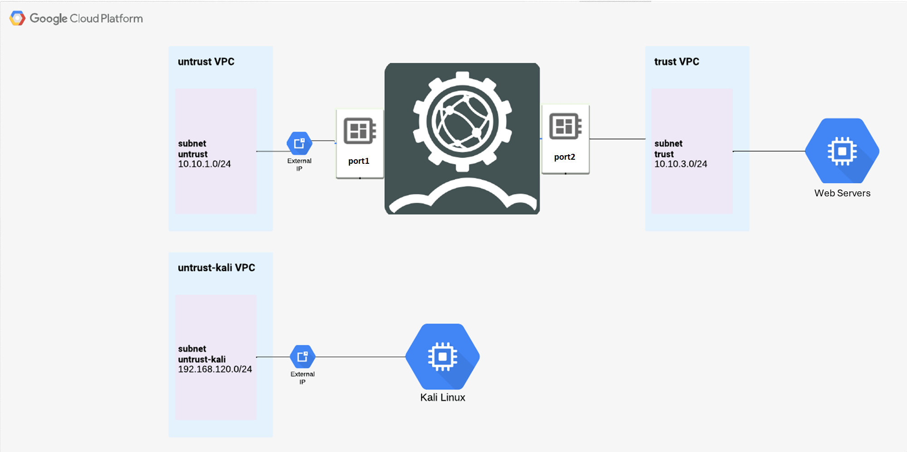

# Setup Requirements

## Access the Qwiklabs

!!! warning
    Note: Use an Incognito or private browser window to run this lab. This prevents any conflicts between your personal account and the Student account, which may cause extra charges incurred to your personal account.

Qwiklabs is a platform where we will run our environment today. This platform creates new cloud accounts for each use.
You'll need to create an account using **the same email address** used for the event registration.

!!! tip
    Note: If you already have your own personal Google Cloud account or project, do not use it for this lab to avoid extra charges to your account.

Go to [Fortinet Qwiklabs](https://fortinet.qwiklabs.com/)

* Click the blue button **Join** in the upper right conner
* Create an account using the same **email address**
* Once logged into Qwiklabs go to **Dashboard** tab
* You'll see the FortiWeb card, click on it
* Click on FortiWeb lab

## Before you click the Start Lab button

Read these instructions. Labs are timed and **you cannot pause** them. The timer, which starts when you click Start Lab, shows how long Google Cloud resources will be made available to you.

This hands-on lab lets you do the lab activities yourself in a **real cloud environment**, not in a simulation or demo environment. It does so by giving you new, temporary credentials that you use to sign in and access Google Cloud for the duration of the lab.

To complete this lab, you need:

* Access to a standard internet browser (Chrome browser recommended).
* Time to complete the lab---remember, once you start, you cannot pause a lab.

1. Click the Start Lab button. On the left is the Lab Details panel with the following:

    * Time remaining
    * Your temporary credentials that you must use for this lab

## Lab - Diagram

Below is a diagram of the lab environment.



## Lab - Preparation

### Task 1: Connect to FortiWeb & WebServer
In this step you will connect to the FortiWeb. Using the outputs from **Student Resources** on the left of the lab start screen, , in your favorite browser, input "**https://FortiWeb-IP:8443**". This will result in a privacy error, due to the self signed certificate in FortiWeb. Click on "Advanced" and then Proceed. Input **admin** as the "Name" and **FortiWeb Password** from **Student Resources** as the "Password". You will be required to change your password. Once this is complete, proceed to login.


1. Once you login you will be at the FortiWeb Dashboard setup


### Task 2: Check Connectivity to WebServer
1. Click on CLI Console to check the connectivity to the web server

    

2. Check connectivity to the web server via CLI-Console. Ping Internal IP of the WebServer.

    

    ``` 
    execute ping 10.10.3.2
    ```

### Task 3: Create Server Pool
1. Navigate to **Server Objects** > **Server** > **Server Pool** > **Create new**

    

2. Input information as shown below. Click **OK**.

    

3. The greyed out Create new button should now appear to create the Server object. Click **Create New**

4. Now enter the IP address of your application server in this case it is the **IP address** of Apache Server, the port number the pool member/application server listens for connections. We are using **port 3000** for our **Juice Shop** container. Click **OK**. Don't worry if your screen is slighty different from the screenshot.

    

5. Repeat steps 1 to 4 for another application, DVWA, which is running in the same webserver but in **port 80** instead of **port 3000**. It should look like this:

    

    

### Task 4: Create Virtual Server and IP

1. Now we will need to create the Virtual Server IP on which the Traffic destined for server pool member arrives. When FortiWeb receives traffic destined for a Virtual server it can then forward to its pool members.

    

2. Enter the name for the Virtual Server and click **OK**

    

3. Click Create new to now create Virtual Server item.

4. Virtual Server item can be an IP address of the interface or an IP other than the interface. In this case we will use the interface IP - Turn on the Radio button for **“Use interface IP”**, a drop down with interfaces will appear. Select **port1** as the interface for this Virtual Server item and click **OK**.

    

5. The Virtual Server for the Apache Server is now using the IP address of the Port1 Interface. 

    !!! tip
        Note: This same Virtual Server will be used for multiple applications (server pool)

    

### Task 5: Create Server Policy
1. We will now create a **Policy** to apply a protection profile to protect our application Server. First we will create for JuiceShop than to DVWA. Before creating a policy let’s look at few default protection profiles which are pre-configured on FortiWeb. The Inline Standard protection profile consists of **signatures** to protect against SQL injection, XSS and other generic attacks. Navigate to **Policy** > **Web Protection Profile**

    

2. Now let’s create a Server policy. Click on **Policy** > **Server Policy** > **Create New**. Input a name for the server policy, select **VirtualServer01** in Virtual Server and **JuiceShop_Server** in Server Pool which we created in the earlier steps from the drop down.

3. Click **HTTP Service** and then click **Create** 

    

4. In the new screen fill as shown below and click **Ok**

    

5. Select the created HTTP Service. In this step we are **not** attaching the Protection profile. Click **OK**.

    

6. Now repeat the same steps to create a server policy for DVWA. For HTTP service, now we can use the HTTP default. At the end it should be like this:

    
