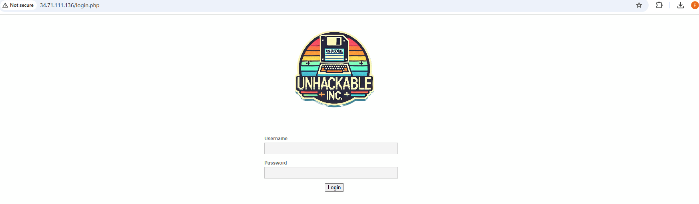

# DVWA

DVWA is one of the applications we are using for tests, to access it for the first time:

1. You must have completed the [Lab Preparation](http://xpertshandsonlabs.eastus.azurecontainer.io/cloud/FortiWeb/02-Preparation/)
2. Open in a web browser (from Kali VM is advised) http://**FortiWeb Public IP**
    
3. User: ```admin``` Password: ```password```
4. Click **Login**
5. Scroll down and click **Create / Reset Database**
    
6. Wait to be redirected or click **Login**
    
7. Use the same credentials from step 3 to login
8. Scroll down and click **DVWA Security**
9. Set it to **Low** and click **Submit**
    
10. Done! You're all set
