# Lab 1: Bot Protection
We usually do sales promotions in our websites, but always we put a product with low price, it sold out very quickly and the "customer" cancel the order few days later... We lost the revenue and our other customers are complaining because they cannot buy it...

Maybe are these "customers" bots? Can you help us to see if we have a bot-proof website?

## Task 1 - Proof of concept
1. Let's see if the a bot could be run against our website. Access Kali VNC using the public IP from Student Resources.
**https://kali-pip/vnc.html**

2. Accept certificate errors and proceed. When prompted, click **Connect**. 

3. At the top of the page, click on the terminal icon (black box). Once open, input:

    ``` 
    vim /simple_ff.py
    ```

    !!! tip
        Note: If you are not familiarized with VIM, some commands can be useful: use INSERT to start editing the file. To exit saving the file: ESC then type ```wq!``` and ENTER. To exit without saving: ESC then type ```q!``` and ENTER

        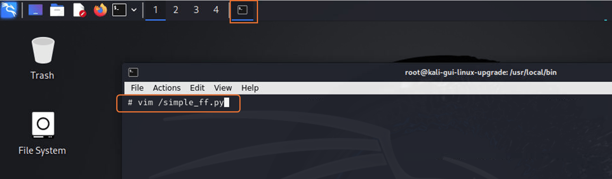


4. Replace the XXXXX with your FortiWeb Public IP

    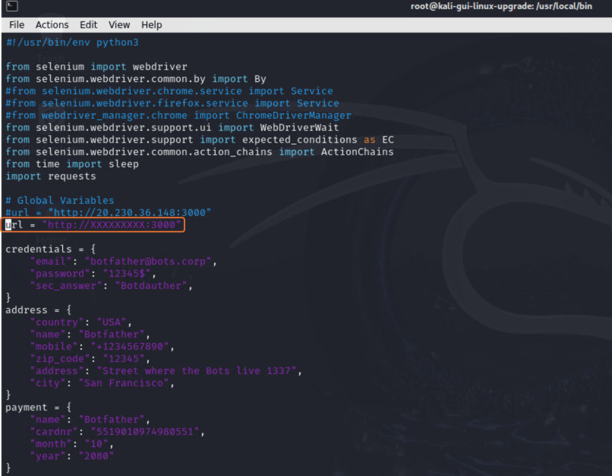

5. With the file changed and saved, type:

    ``` 
    python3 /simple_ff.py
    ```

    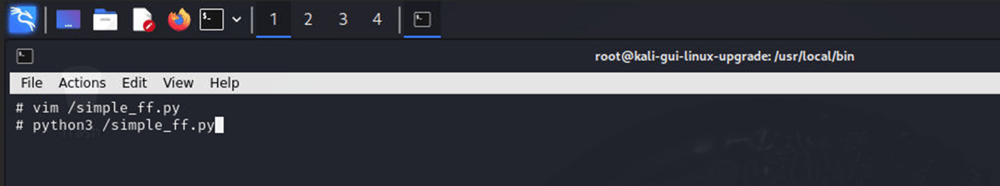

6. It will open Firefox and the bot will start running.

    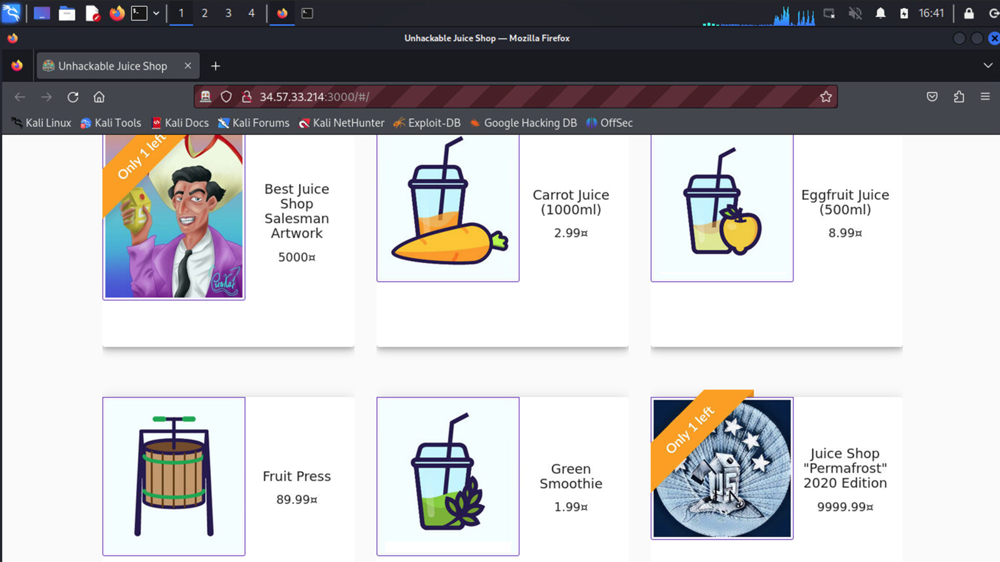

7. You will see it "clicking" in the webpage products, creating new user, adding address, payment options, adding items to the basket (shopping cart) and checking out. Wait for it completes all the tasks. When done it will show you in the terminal:

    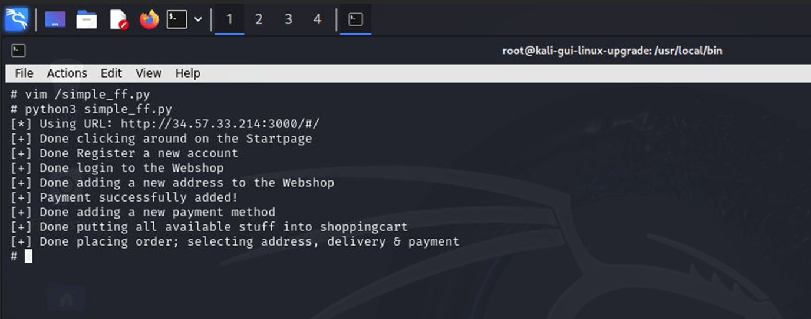

## Task 2 - End bot's party
1. Ok... we know bots can use our website... let's learn one way that we can block them. Open **FortiWeb** and go to **Bot Mitigation** > **Biometrics Based Detection**. Click **Create New**

    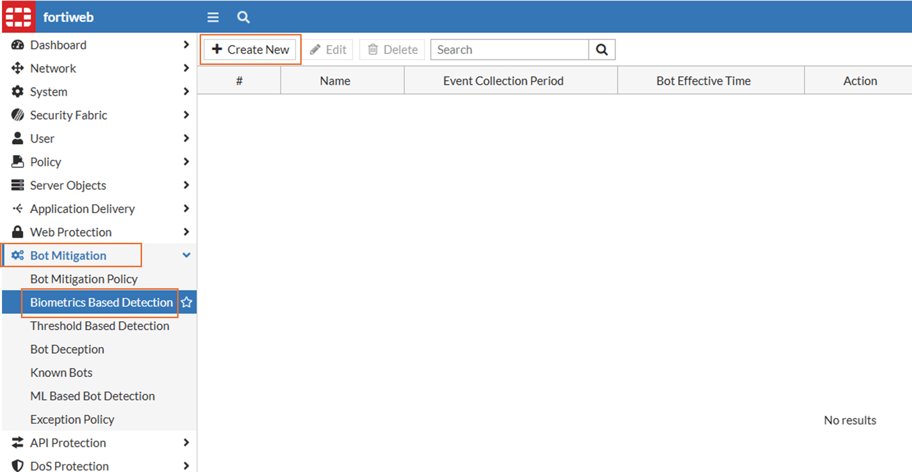

2. Fill like we shown below and click **Ok**:

    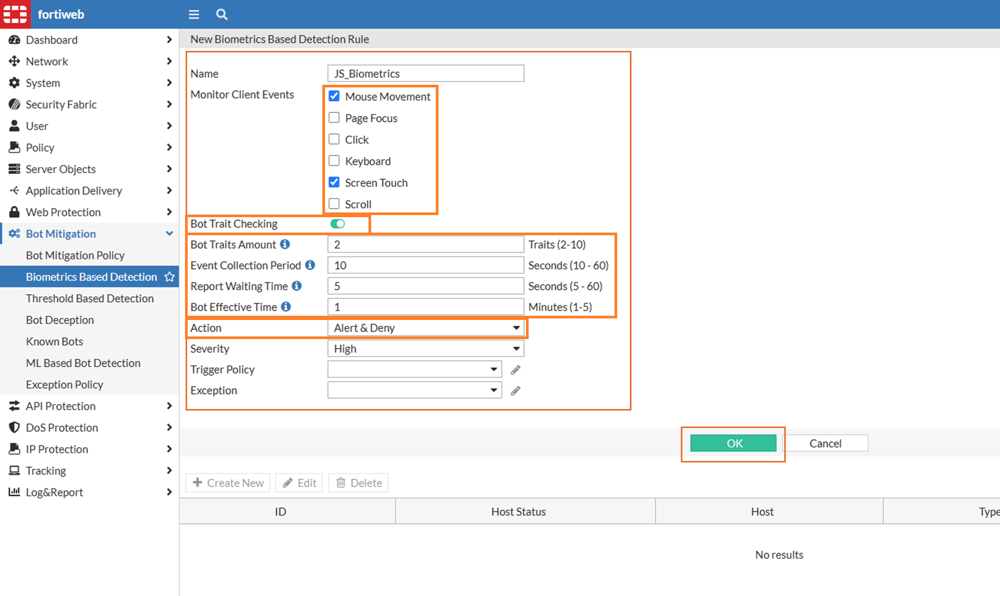

3. In the same page, now click **Create New**. Fill the fields as shown below and then click **OK** twice

    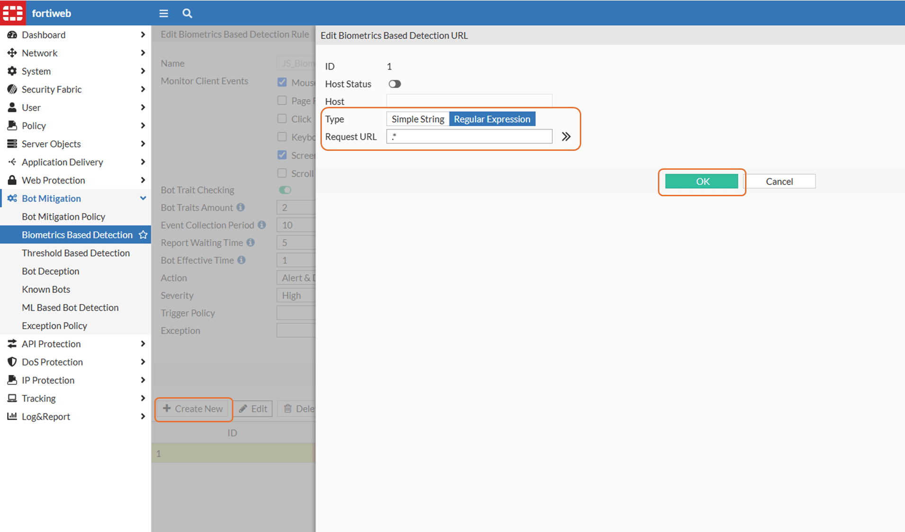

4. Click **Bot Mitigation Policy** menu and then **Create New**

    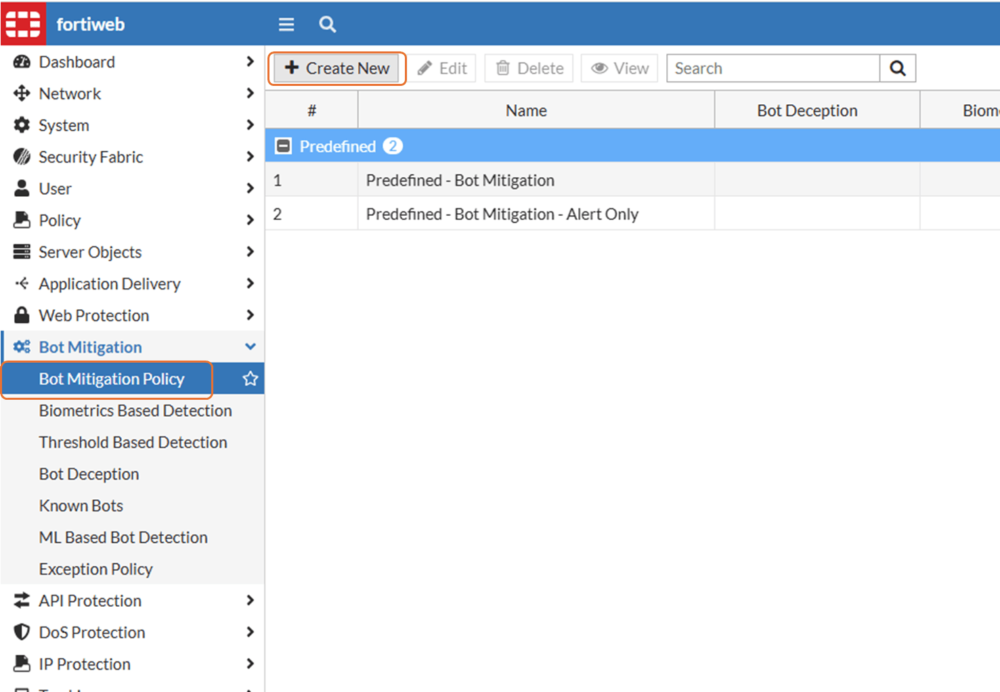

5. Make yours look like below and click **OK**

    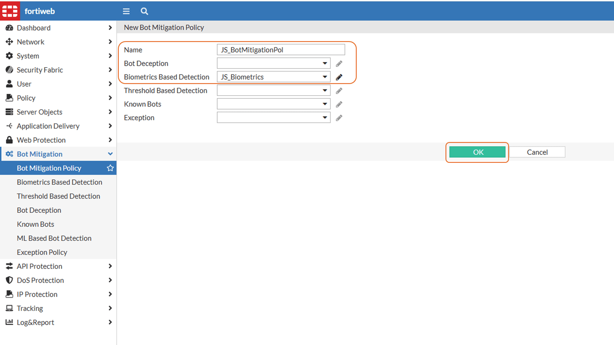

6. Now, go to **Policy** > **Server Policy** and double click **SP_JuiceShop**
    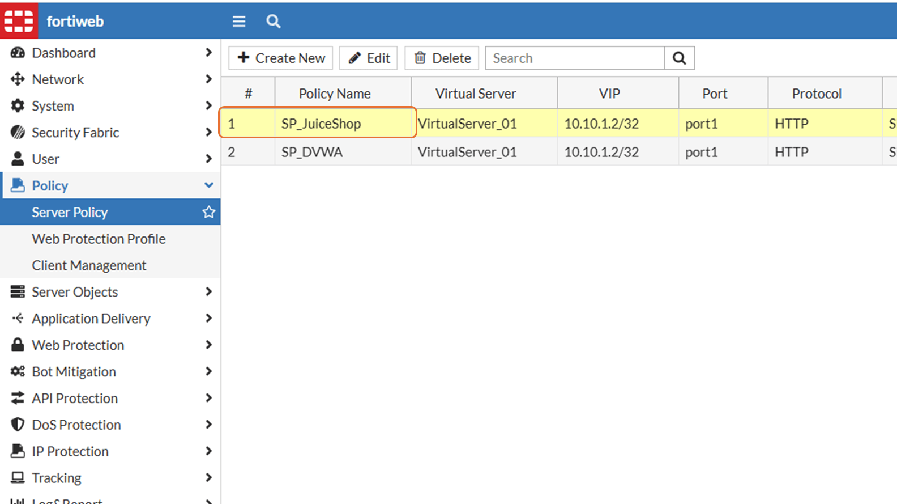
7. Scroll down to **Web Protection Profile**, click on it and then click **Create**
    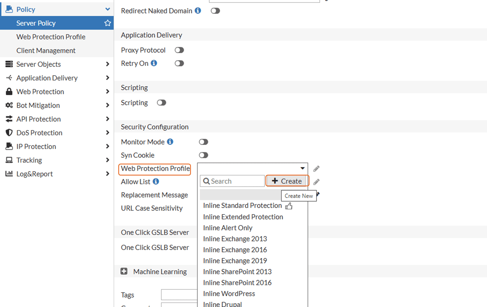

8. Name it as **WP_JuiceShop**

    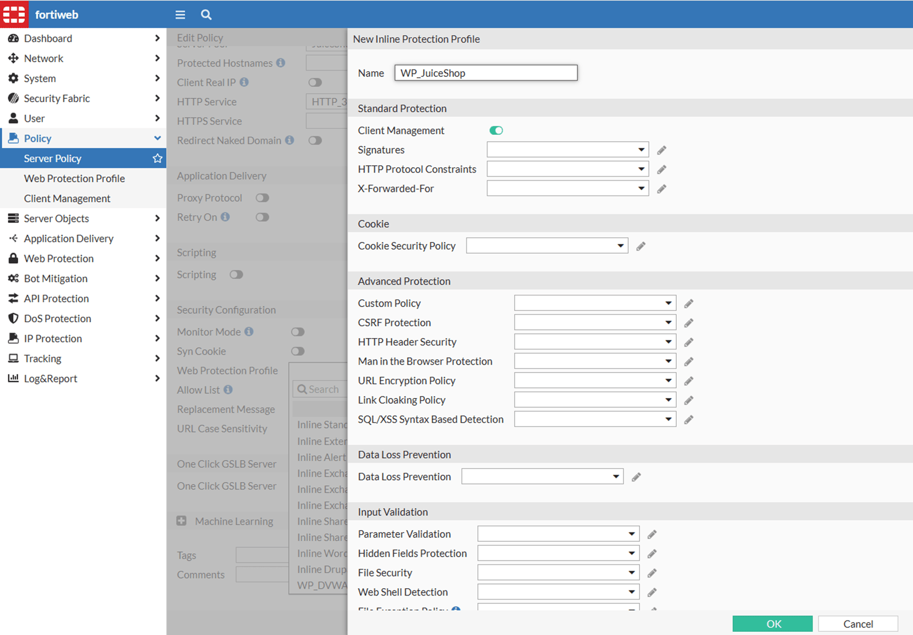

9. Scroll down to **Bot Mitigation Policy** and select the one created earlier. Click **OK**. Make sure the new **Web Protection Profile** is selected and click **Ok** again

    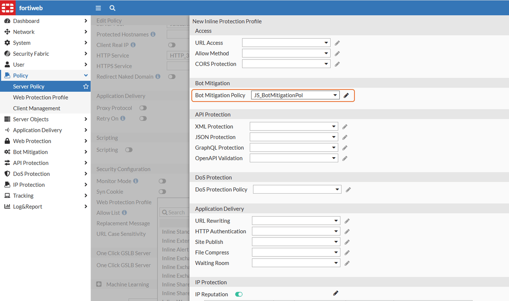
    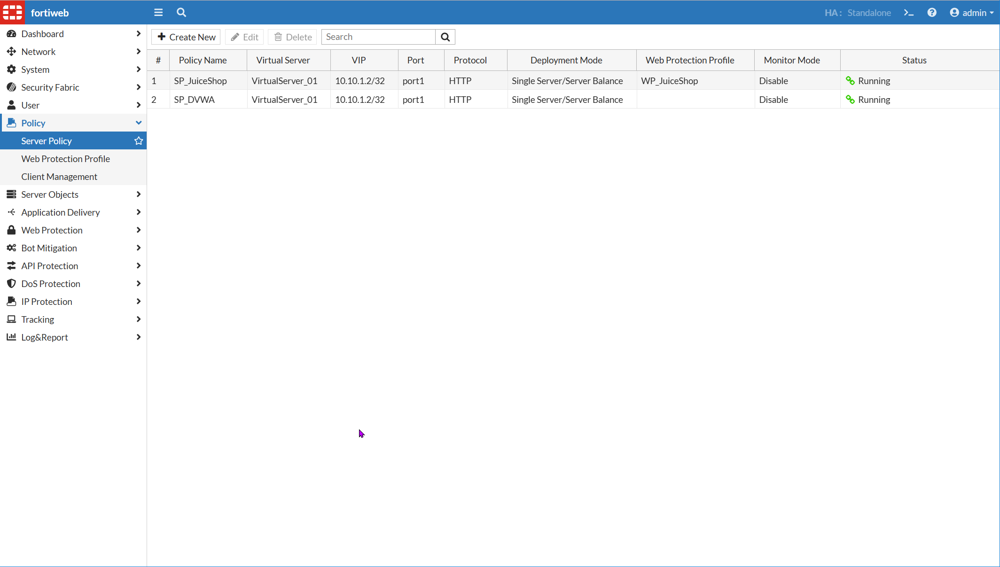

10. Go back to your Kali terminal and run the same command again

    ```
    python3 /simple_ff.py
    ```

11. Firefox will open and perform the same tasks again. However, this time it will stop in some step, like the one below

    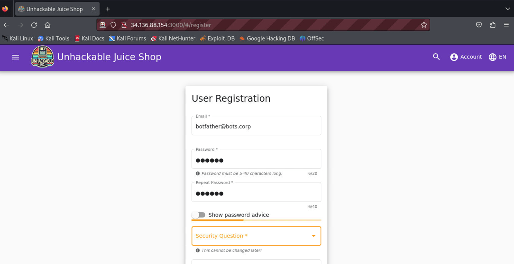

12. Minimize Firefox and go back to Kali terminal, you will see errors similar to these:

    

13. Go back to Firefox and update the page (CTRL+R) you will see FortiWeb block message

    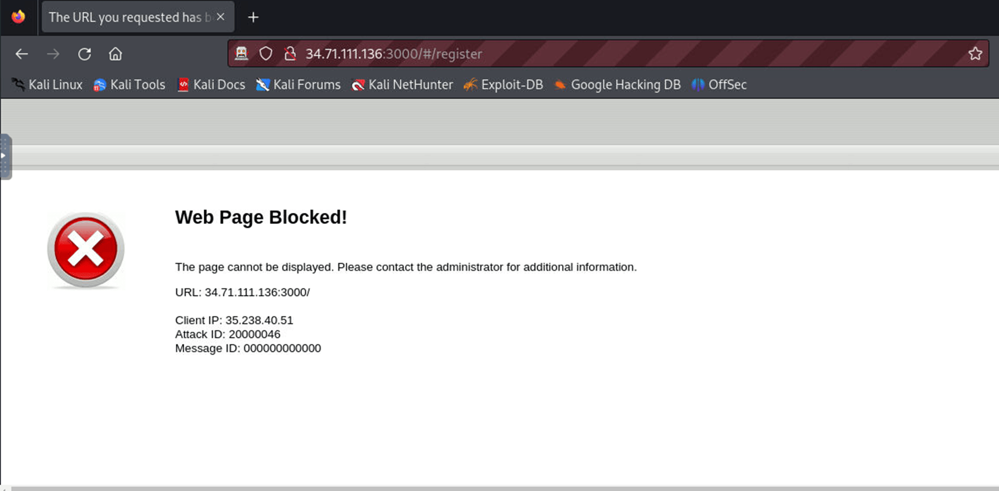

    !!! warning
        Important: If you don't see the error/block message after the first time, it could be the FortiWeb learning from the behavior. Try it twice more.

14. This was one way to block bot based on biometrics, but FortiWeb is rich of features to fight against them, including a ML special for bot protection


