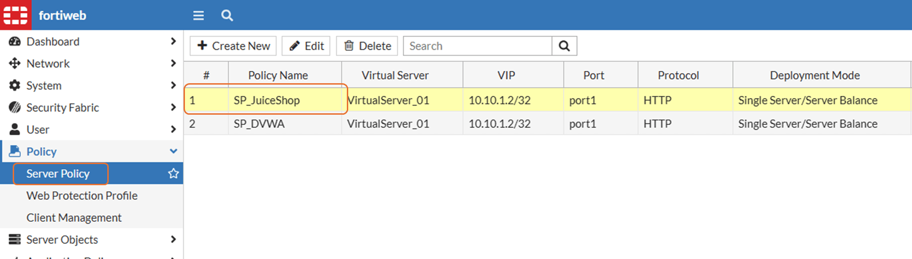
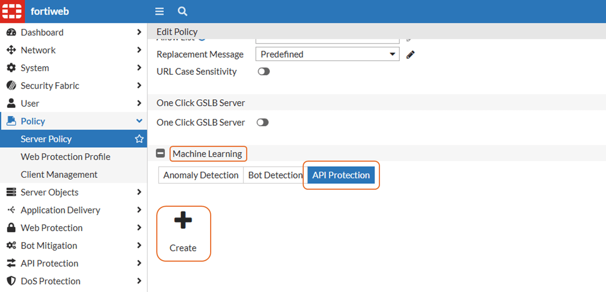
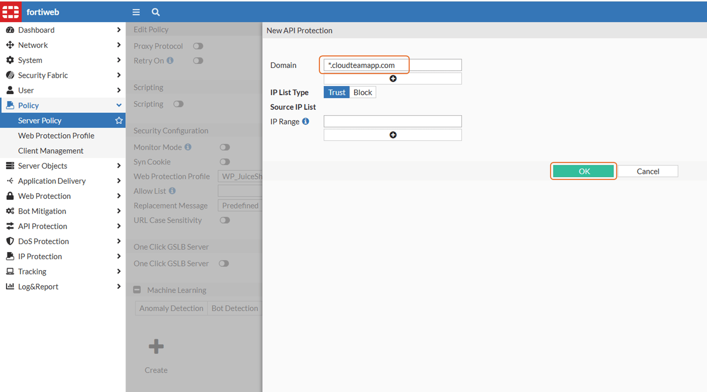
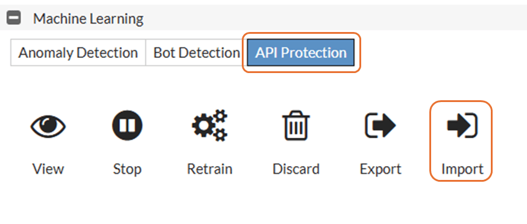
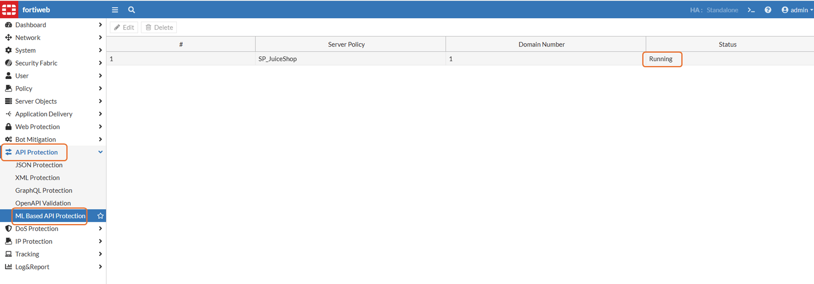
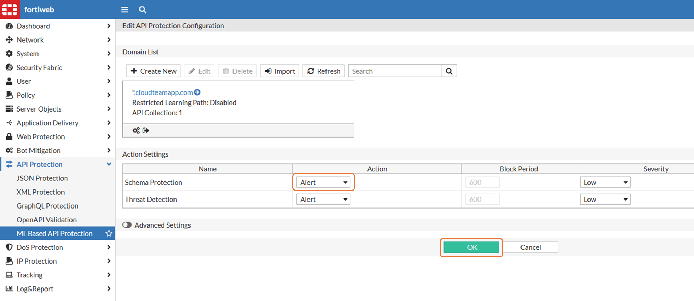
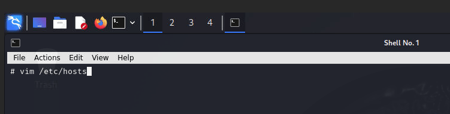
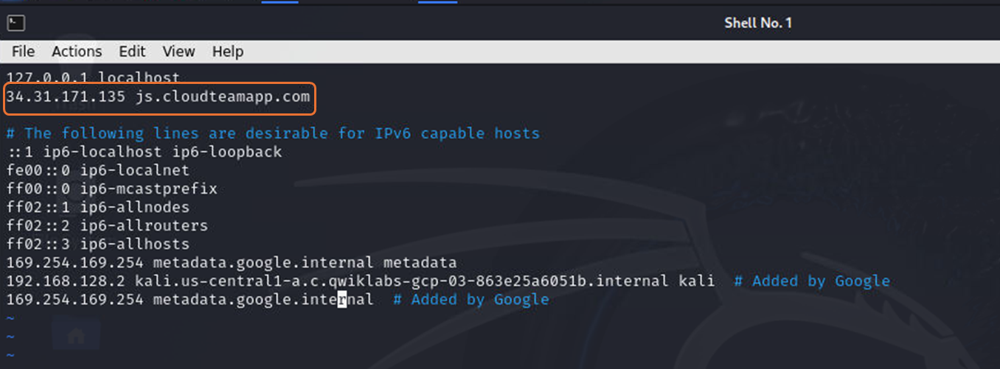
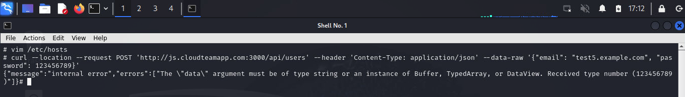
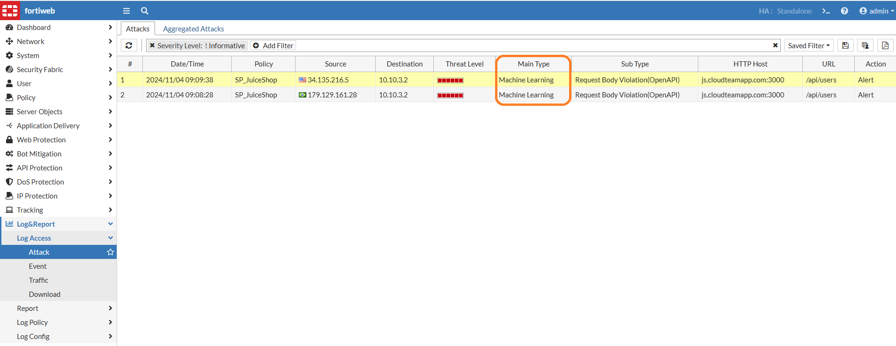

# Lab 2: ML API protection

In almost every modern application we have API calls. It could be a web frontend calling microservices, mobile apps sending and getting information or even a "pure API" that can be called by others to get or upload some information. It doesn't matter how it happens, we need to protect them. In this lab we will protect using part of FortiWeb Machine Learning features.

## Remember how FortiWeb ML works

FortiWeb employs two layers of machine learning to detect malicious attacks. The first layer uses the **Hidden Markov Model** (HMM) and monitors access to the application and collects data to build a mathematical model behind every parameter and HTTP method. Once completed, it will **verify every request** against the model to determine whether it's an **anomaly** or not.

Once the first layer of machine learning triggers a request as an **anomaly**, FortiWeb will use the **second layer** of machine learning to verify whether it's a **real attack or just a benign anomaly** that should be ignored. To do so, FortiWeb includes pre-built trained threat models. Each represents a certain attack category, such as SQL Injection, Cross-site Scripting, and so on. Each threat model is already trained based on analysis of thousands of attack samples. Threat models are continuously updated using the FortiWeb Security Service. When new attack types are released, the FortiGuard team analyzes the new threats and re-trains the relevant threat model. The new threat model is then pushed to all customer installations in a way similar to how signatures are updated.

## Task 1 - Configuration

1. Go to FortiWeb and edit SP_JuiceShop Server policy
    
2. Scroll down and click **Machine Learning** > then click **API Protection** button > **Create**
    
3. In **Domain** type the value below and click **OK**:
    ``` *.cloudteamapp.com ```
    
4. In a new browser tab, download the dat file below. This file was created in ML training process:
    ```
    https://raw.githubusercontent.com/FortiLatam/juiceshop/refs/heads/main/helpers/juiceshop_policy.apilearning.dat 
    ```
5. Back to FortiWeb UI, click **API Protection** again and **Import**
    
6. Select the dat file downloaded earlier and upload it. Click **OK** twice.
7. Go to **API Protection** > **ML Based API Protection**
8. You should see **Running** status
    
9. Double click it and change the **Schema Protection** from **Standby** to **Alert** and click **OK**
    
10. Feel free to navigate in this area. You will see the ML was trained with only one parameter, but in real scenarios, you will see it for all parameters used.

## Task 2 - Test it

1. We used the following command to train the ML. We can see the email parameter has a standard, as well the password with the value of “abcdefgh”
    ```
    curl --location --request POST 'http://js.cloudteamapp.com:3000/api/users' --header 'Content-Type: application/json' --data-raw '{"email": "test2@example.com", "password": “abcdefgh”}'
    ```

    !!! warning
        Important: You must use the domain "js.cloudteamapp.com" to do the following tests because it was the domain name used to train the ML. To do it, you must change the hosts file of the desktop you are using. Feel free to change your own file to do so, or to use the Kali VM provided. The instructions below are for Kali.

    A. In Kali VM, open terminal and type:
    ```
    vim /etc/hosts
    ```

    

    !!! tip
        Note: If you are not familiarized with VIM, some commands can be useful: use INSERT to start editing the file. To exit saving the file: ESC then type ```wq!``` and ENTER. To exit without saving: ESC then type ```q!``` and ENTER
    
    B. Change the file adding your **FortiWeb Public IP** followed by **js.cloudteamapp.com** as an ***EXAMPLE*** below

    

2. Now run the command below to trigger an anomaly and press **ENTER**

    ``` 
    curl --location --request POST 'http://js.cloudteamapp.com:3000/api/users' --header 'Content-Type: application/json' --data-raw '{"email": "test5@example.com", "password": 123456789}' 
    ```

3. You will see an error message similar to:

    

4. It wasn't an attack, but it triggered an **anomaly** detected by FortiWeb Machine Learning. We had several customers request about this kind of security feature, where in a real situation, one of the largest bank in LATAM had one of its API attacked where the customer saw the user id request was slighty different from expected. All the users should have the format 111.111.111 (with dots between 3 numbers) and this was formatted by the frontend, but the API was reachable without going through the frontend and all the requests were 111111111 (without the dots). With this kind of feature, they could stop the enumeration attack in progress.

5. Check FortiWeb logs for more information

    


