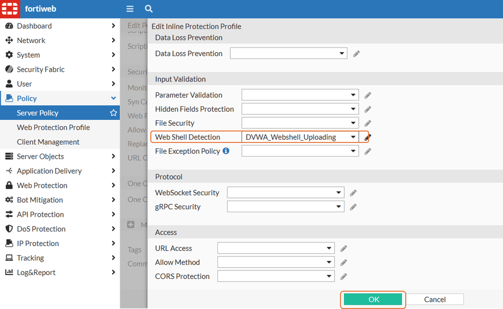

# Lab 3: Web Shell Detection

Attackers may attempt to upload Trojan horse code (written in scripting languages such as PHP and ASP) to the back-end web servers. The Trojan then infects clients who access an infected web page.

!!! tip
    Note: to configure FortiWeb you can use your own browser, but for doing the attacks, maybe your EDR can block them, so you can use the Kali VM (VNC) to perform those tasks.

## Task 1 - Configuration
1. Go to **Web Protection** > **Input Validation** > **Web Shell Detection**
2. Click **Create New**
3. Name it as ``` DVWA_Webshell_Uploading ``` and follow the settings below:

    

4. Enable it in the Web Protection Profile. Go to **Policy** > **Server Policy** > **SP_DVWA**

    !!! tip
        **TIP:** You will need to create a new **Web Protection Profile**. If you need help, review the link [Helper - How to enable/disable Web Protection Profile](https://docs.amerintlxperts.com/cloud/FortiWeb/90-enable-disableWeb%20Protection%20Profile%20for%20DVWA/).

5. Scroll down to Web Protection Profile and make sure **WP_DVWA** is selected
6. Click on the pencil to edit the profile

    

7. Select the **Web Shell Detection** policy created earlier. Click **OK**.

    


## Task 2 - Test it

1. In Kali Linux web browser download the file ```https://raw.githubusercontent.com/FortiLatam/juiceshop/refs/heads/main/helpers/wso.php``` and save it wherever you want

    !!! tip
        **TIP:** If you are using the feature to copy/past clipboard and you dont see the option to paste in Kali's web browser, use CTRL + SHIFT + V.

    

2. In DVWA click on **File Upload** then **Browse**

    

3. Select the file you downloaded and click **Upload**

    

4. You will see FortiWeb just blocked it.

    

5. This kind of attack is common and can affect other users or even other systems/applications


