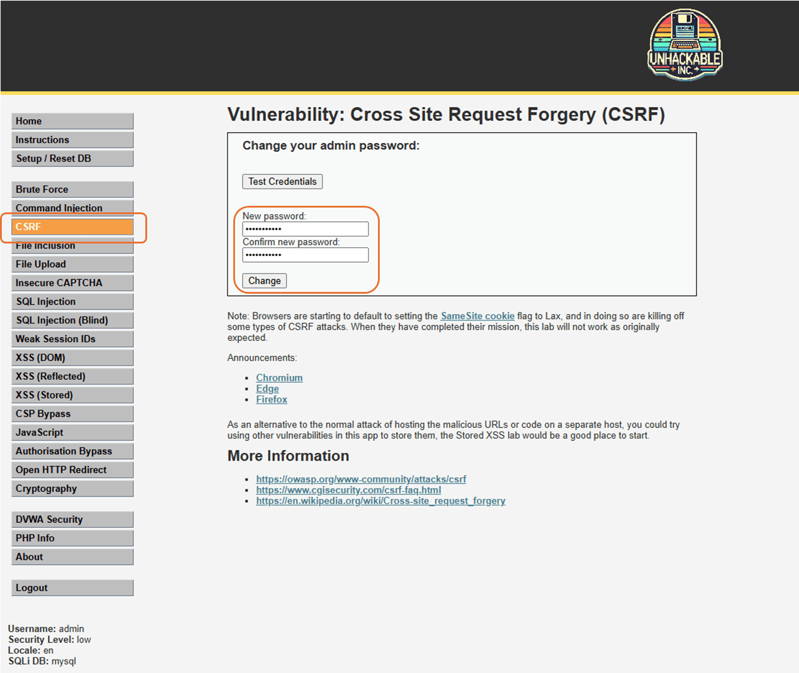
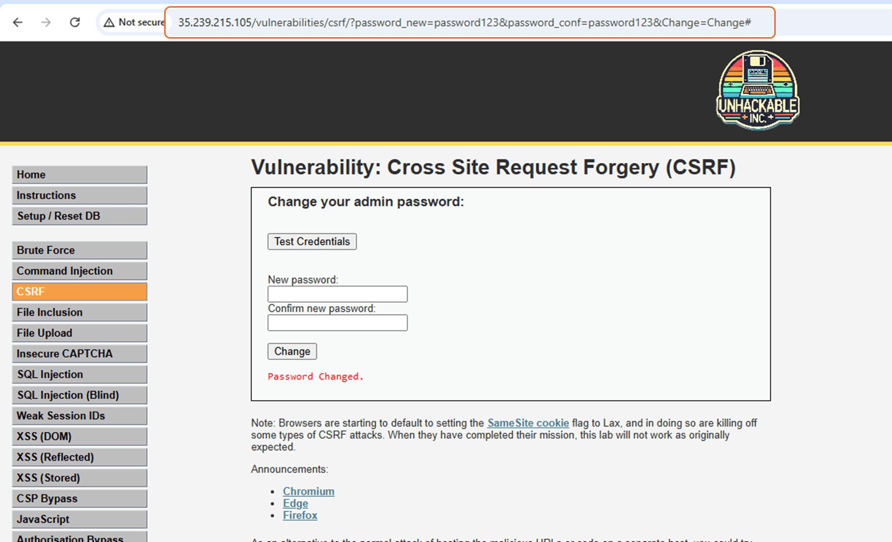
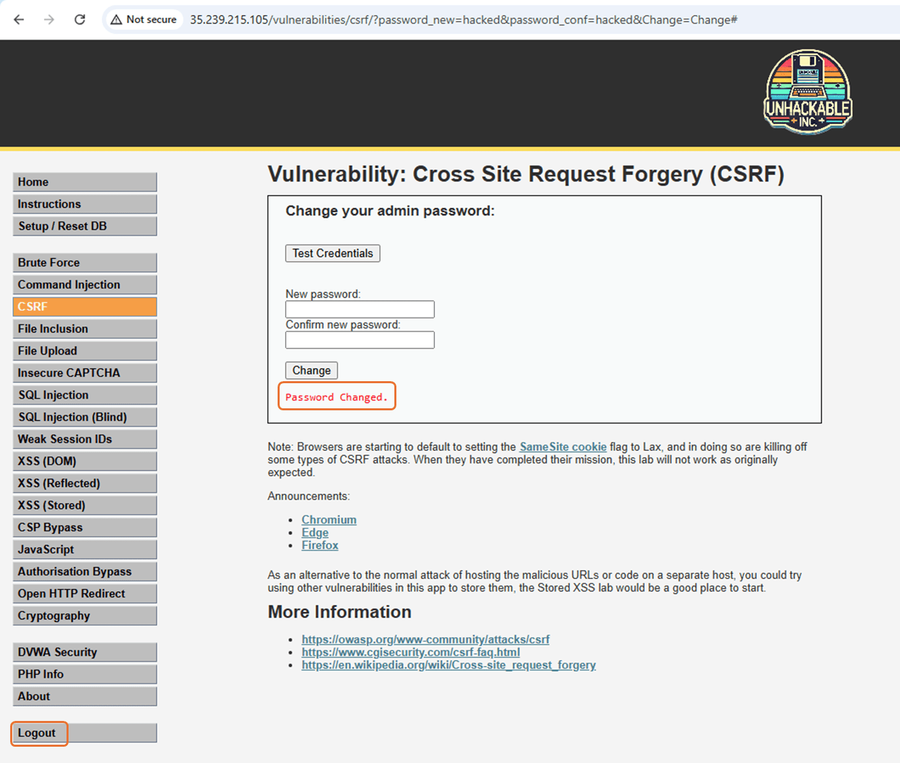
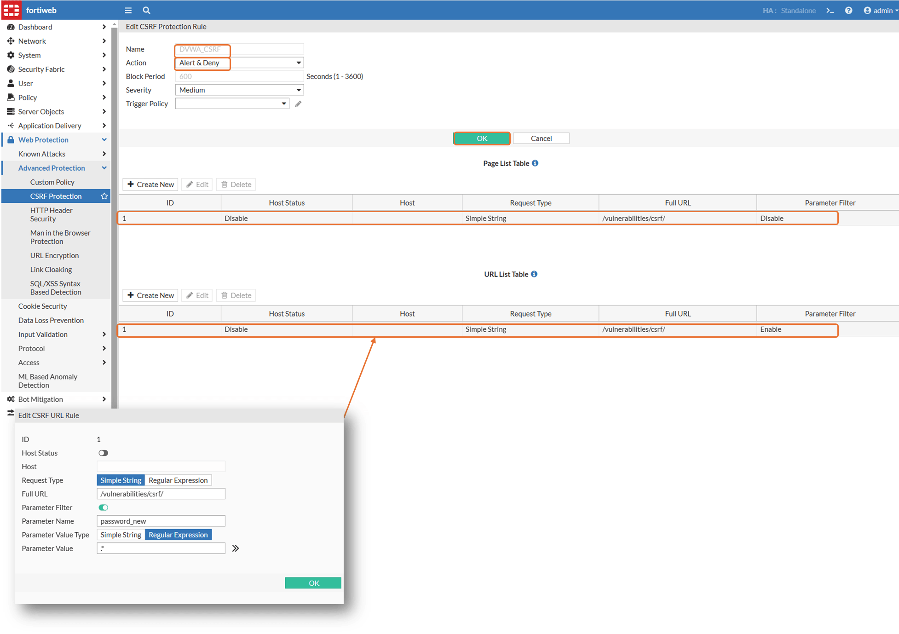
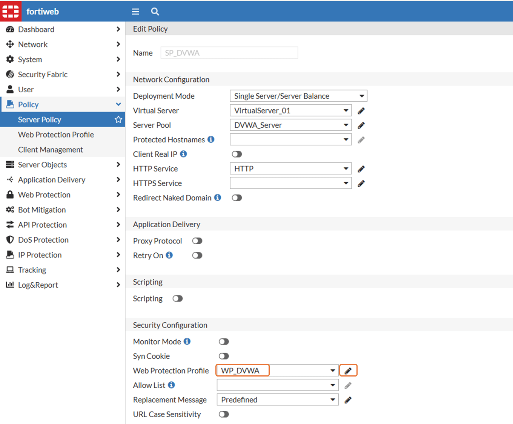
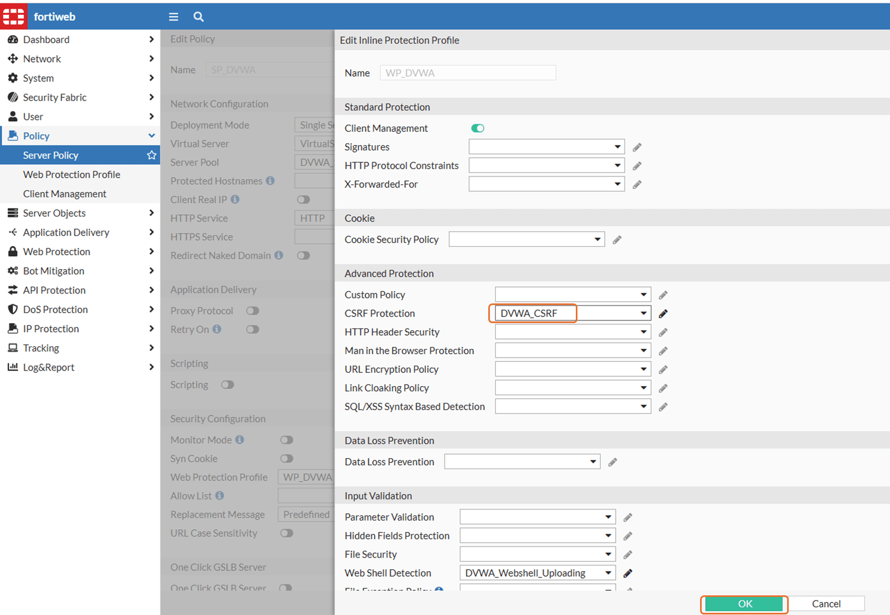
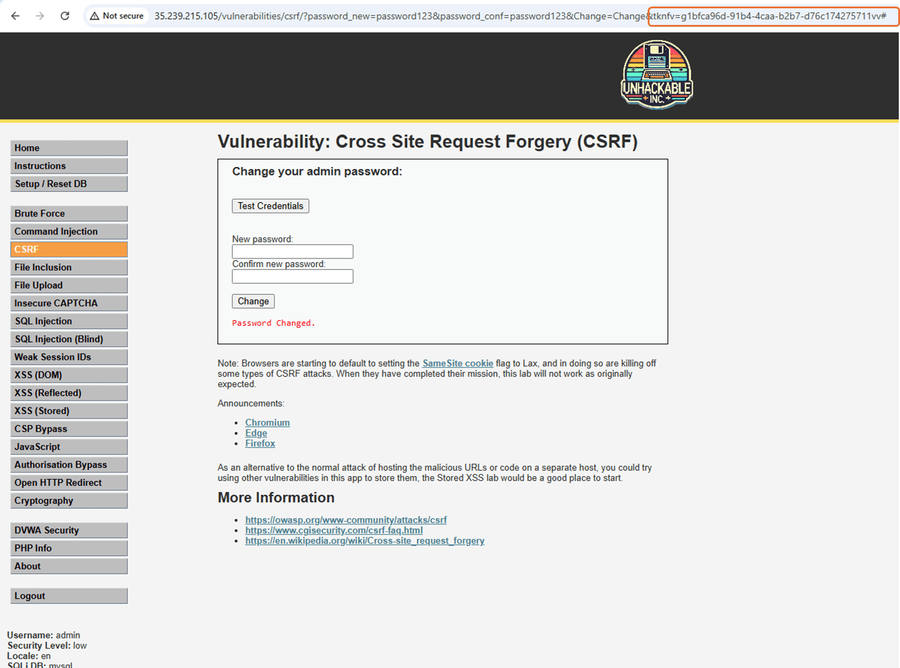
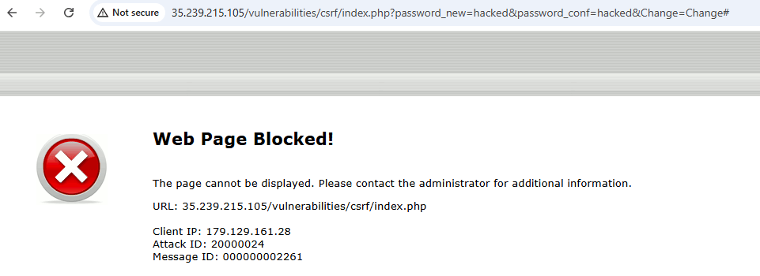

# Lab 4: CSRF Protection

Cross-Site Request Forgery (CSRF) is an attack that forces an end user to execute unwanted actions on a web application in which they're **currently authenticated**. CSRF attacks specifically target state-changing requests, **not theft of data** since the attacker has no way to see the response to the forged request. With a little help of social engineering (such as **sending a link** via email or chat), an attacker may trick the users of a web application into executing actions of the attacker's choosing. If the victim is a normal user, a successful CSRF attack can force the user to perform state changing requests like **transferring funds**, changing their email address, and so forth. If the victim is an administrative account, CSRF can compromise the **entire web application**.

!!! tip
    Note: to configure FortiWeb you can use your own browser, but for doing the attacks, maybe your EDR can block them, so you can use the Kali VM (VNC) to perform those tasks.

## Task 1 - POC
1. Test what this attack can do. Open DVWA, it is the FortiWeb Public IP in port 80 (admin / password)
2. Make sure DVWA Security is set to low
2. Click CSRF menu on the left
3. Change the password

    

4. You will see a message "Password changed". Copy the URL generated

    

5. In my example, I changed the password to **password123**. Now edit the URL to change the password to **hacked** and paste it in another browser tab:

    ```
    http://FortiWeb Public IP/vulnerabilities/csrf/?password_new=hacked&password_conf=hacked&Change=Change#
    ``` 

6. Click on Logout and login again, now using password **hacked**
    


## Task 2 - Configuration
1. Go to **Web Protection** > **Advanced Protection** > **CSRF Protection**
2. Click **Create New**
3. Name it as ``` DVWA_CSRF ``` and follow the settings below. Click **OK** if you see **Create new** grayed out

    URL: ```
    /vulnerabilities/csrf/ 
    ``` 

    

4. Click **OK** to save it
5. Add this policy to our **Web Protection Profile**. Go to **Policy** > **Server Policy** > Edit **SP_DVWA**
6. Make sure Web Protection Profile selected is WP_DVWA and click the pencil in the right

    

    !!! tip
        **TIP:** If needed, review the link [Helper - How to enable/disable Web Protection Profile](https://docs.amerintlxperts.com/cloud/FortiWeb/90-enable-disableWeb%20Protection%20Profile%20for%20DVWA/).
        
7. Select the CSRF policy created earlier and click **OK** twice

    

## Task 3 - Test it
1. Open DVWA. Same as before, it is the FortiWeb Public IP in port 80 (admin / password)
2. Click CSRF menu on the left
3. Change the password

    

4. In my example, I changed it back to **password123**. See we now have a token generated by FortiWeb. Try to access the same URL we did in Task 1 - step 5 (without the token)

    ``` http://FortiWeb Public IP/vulnerabilities/csrf/?password_new=hacked&password_conf=hacked&Change=Change# ``` 

5. You will see a block page from FortiWeb

    

6. Check FortiWeb Attack logs for more detail
