# Lab 5: User tracking

Thanks we now have you in our security team! So glad you managed to check and fix a lot of issues we have. Before you're part of Unhackable our systems were... well... you already know... so we need to check who are the malicious users we have using the applications. I heard something about a feature in FortiWeb to help us with that.

*The user tracking feature allows you to track sessions by user and capture a username for reference in traffic and attack log messages.*

Let's try?

## Task 1 - Configuration
1. Log in FortiWeb
2. Go to menu **Tracking** > **User Tracking**
3. Under **User Tracking Policy** click **Create New**
4. Name it as ```DVWA_User_Tracking_Policy```
5. Click **OK** and **Create New**

    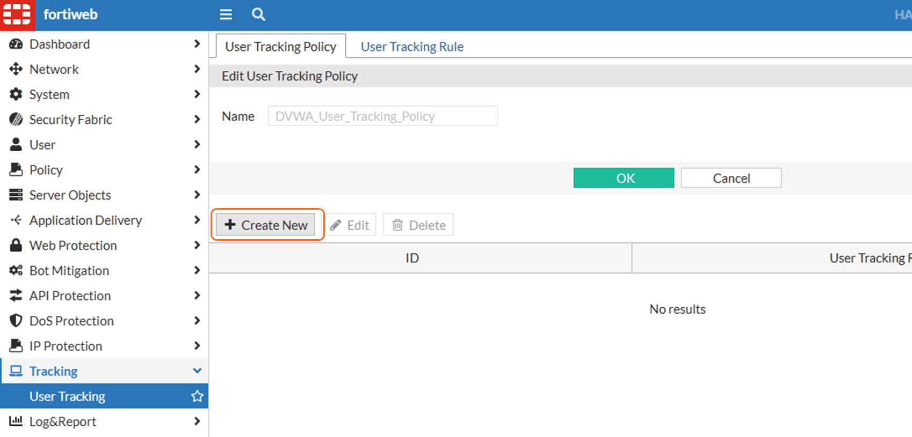

6. Expand **User Tracking Rule** dropbox and click **Create**
7. Set it as follows and click **OK**

    Field | Value | 
    |-------|--------------------------------|
    | Name  | ``` DVWA_User_Tracking_Rule``` |
    | Authentication URL    | ```  /login.php ``` |
    | Username  |``` username ``` | 
    | Password  | ```password ``` |
    | Session ID Name   |``` PHPSESSID ``` |
    | Logoff Path   | ``` /logout.php ``` |

    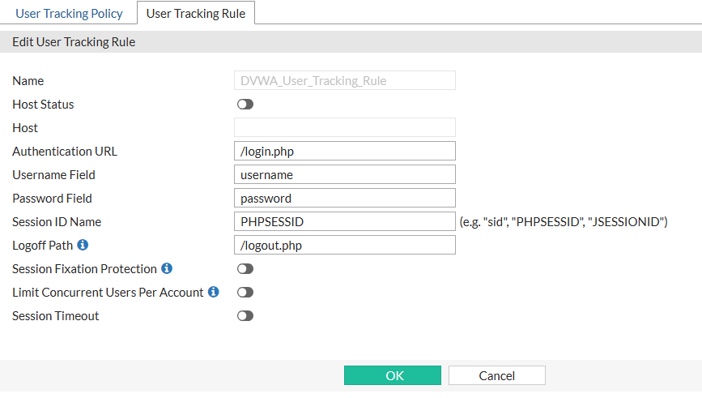
    
8. Select the rule created and click **OK**

    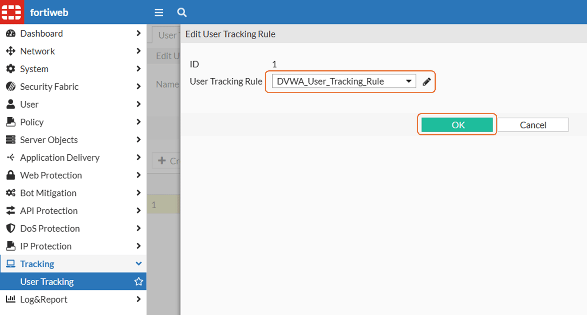
9. Go to **User Tracking Rule** and edit the rule we just created

    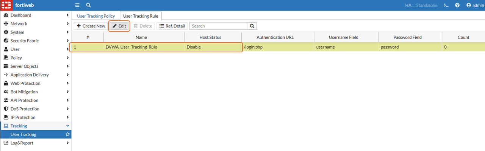

10. Click **Create New** and set it like below:

    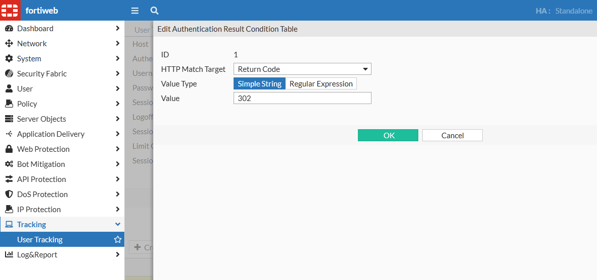

11. Click **OK** twice
12. Go to menu **Policy** > **Server Policy** > edit **SP_DVWA**
13. Make sure Web Protection Profile selected is **WP_DVWA** and click the pencil in the right
    !!! tip
        **TIP:** If needed, review the link [Helper - How to enable/disable Web Protection Profile](https://docs.amerintlxperts.com/cloud/FortiWeb/90-enable-disableWeb%20Protection%20Profile%20for%20DVWA/).
13. Select **Standard Protection** under **Signatures**

    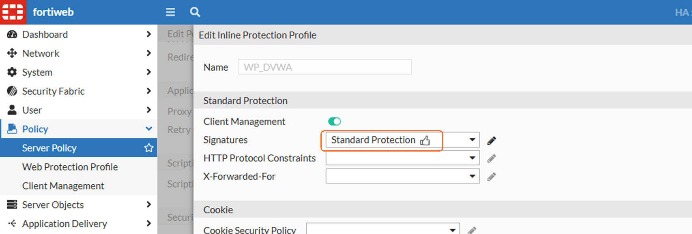

14. Scroll down to **User Tracking** and select **DVWA_User_Tracking_Policy**. Click **OK** twice

    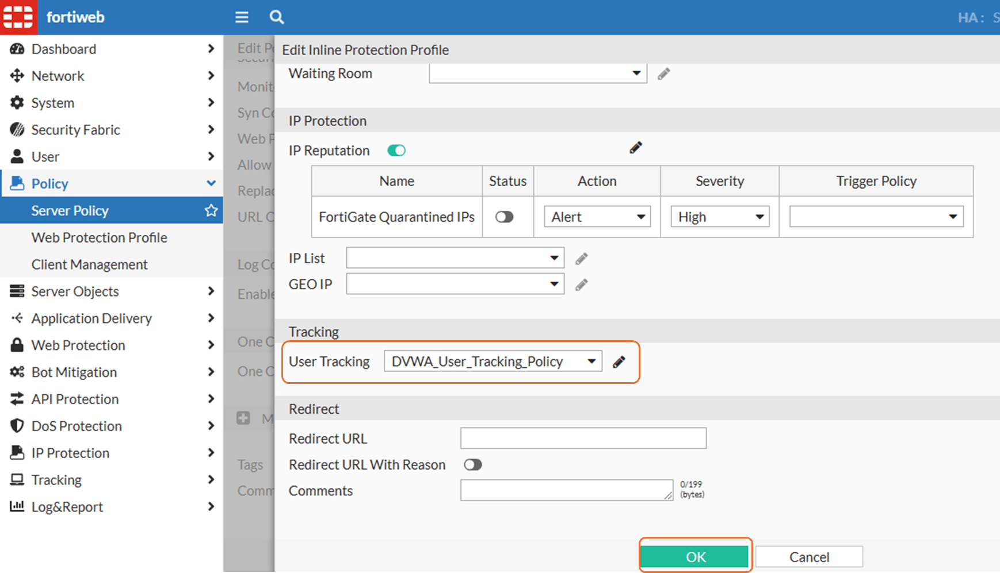


## Task 2 - Test it

1. Open DVWA. Same as before, it is the FortiWeb Public IP in port 80
2. If you are logged in, click **Logout** in bottom left
3. Login using one of the users below:

    Username | Password | 
    |-------|--------------------------------|
    | gordonb  |abc123|
    | pablo    |letmein|
    | smithy  |password  

4. Make sure **Security Level** is set to **low**
5. Go to menu **Command Injection**
6. Under **Enter an IP address** type ```;ls -la``` click **Submit**

    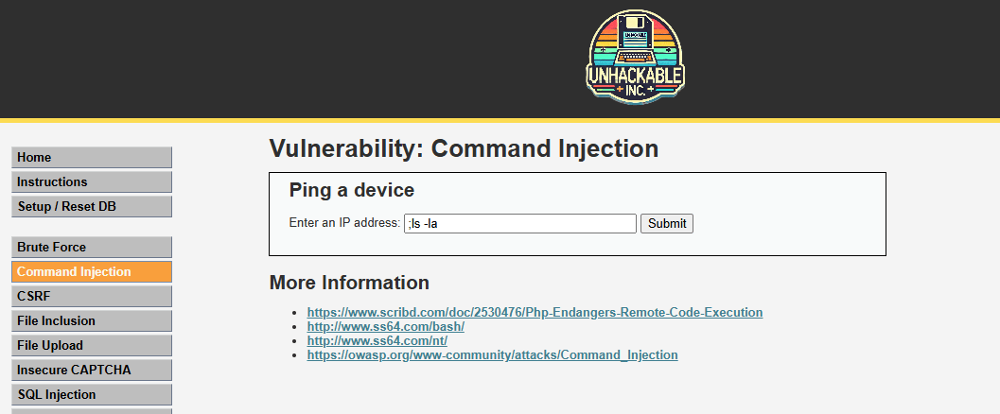

7. You will see FortiWeb block page

    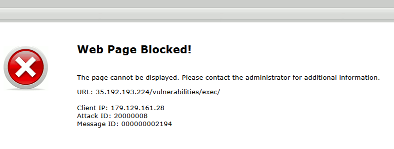

8. Back to FortiWeb and go to menu **Log & Report** > **Log Access** > **Attack**
9. Right-click in **URL**, for example, and scroll down until you see **Username**, click on it and then **Apply**

    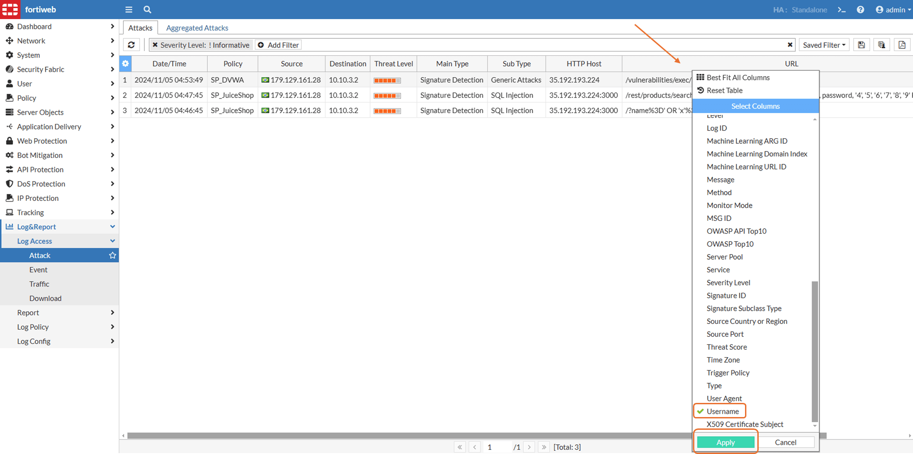

10. Now you will see what was the username used for an attack

    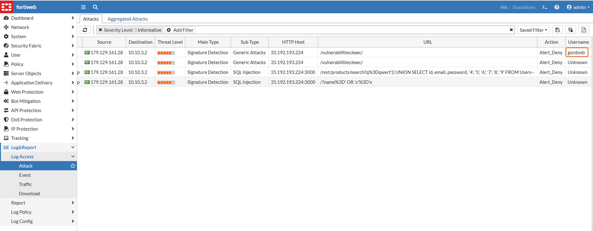
