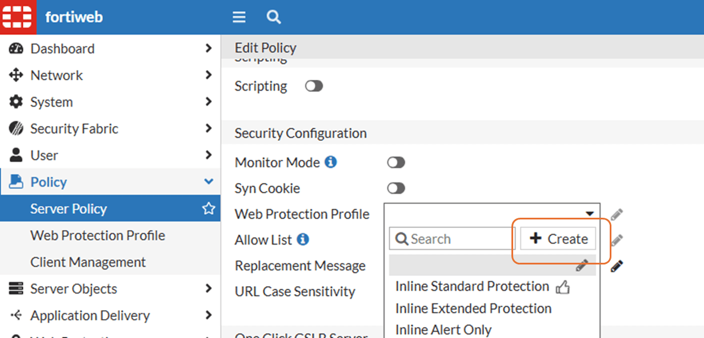
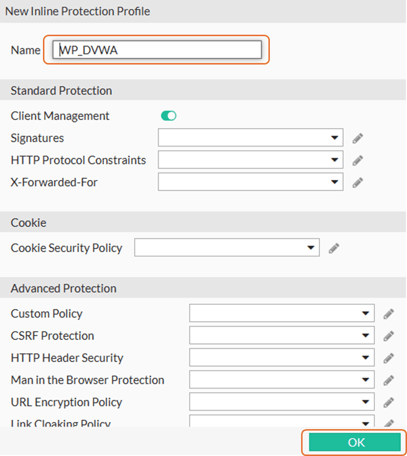
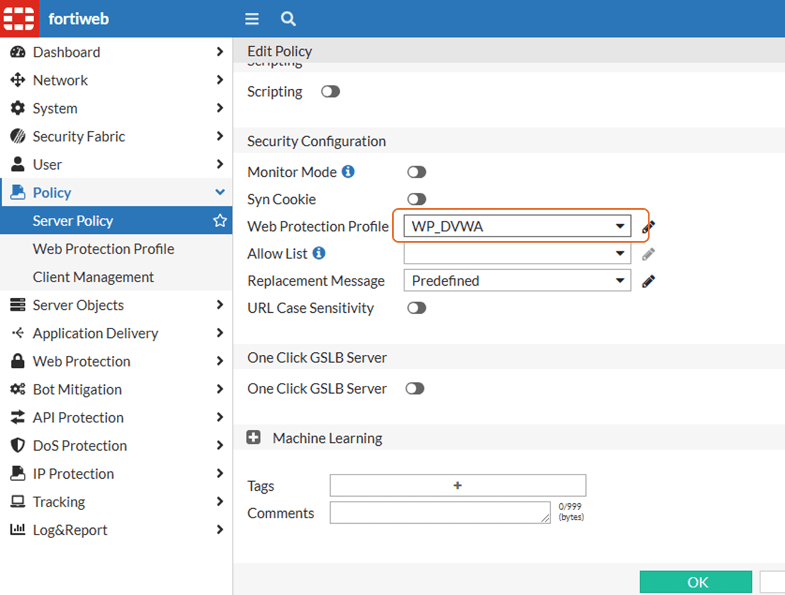
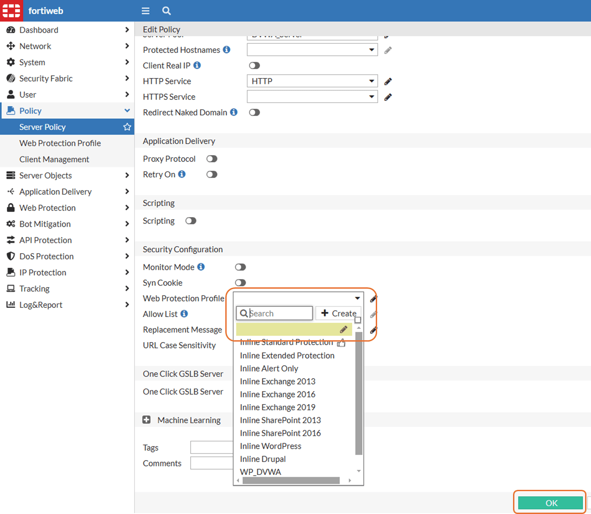

# Web Protection Profile

We will change the web protection profile multiple times, as we are adding new security features and also to disable it, as we want to see how is the application behavior without FortiWeb protecting it.

## Create and enable a Web Protection Profile

1. Go to **Policy** > **Server Policy**
2. Double click **SP_DVWA**
3. Scroll down to **Security Configuration** and click the box **Web Protection Profile**
4. Click **Create**

5. Name it as **WP_DVWA** and click **OK**

6. Now you can select the profile created and Click **OK**

## Disable protections Web Protection Profile

1. When you need to disable the security filters/features/blocks/etc go to **Policy** > **Server Policy**
2. Double click **SP_DVWA**
3. Scroll down to **Security Configuration** and click the box **Web Protection Profile**
4. Leave it empty and click **OK**

