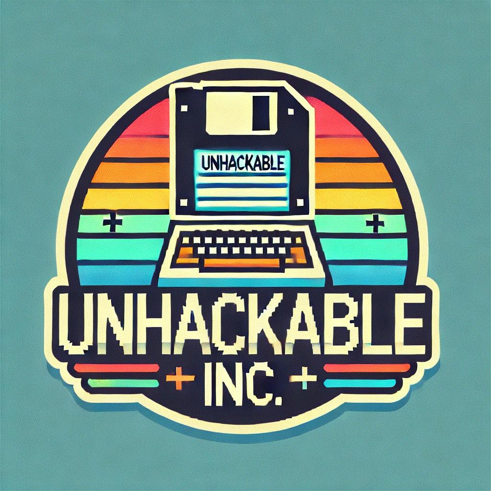

---
buttons:
  - title: Hands on Lab - Download
    icon: material-file-download-outline
    attributes:
      class: md-content__button md-icon
      href: ../hands-on-labs.pdf
      target: _blank
---

# Hands on labs

<center></center>

<h2 style="text-align: center;">Welcome New Hires!</h2>

<br>

Congratulations and welcome to your first day at **Unhackable Inc!**
The world’s pre-eminent purveyor of commoditized goods.

You’ll be joining our security team... which should be a pretty easy gig based on our recent multi-million dollar investment into state-of-the-art Master Locks for all of the doors in the building. Nevertheless, some hotshot on the team recently purchased a new tool called *“Lace Works 40 Sea Naps”* that is supposed to help *"improve"* things (fixing what ain’t broken if ya ask me)—your first job is going to be to try to operationalize this new investment.

The platform claims to improve our security in three primary ways:

- Helping us **prevent** making mistakes while building and deploying software.
- Helping us **protect** our systems by finding mistakes before the bad folks do.
- Helping us better **detect and respond** to threats in the unlikely event that we get hacked because of those mistakes.
  *(But come on, what are the chances of that happening a third time in the same year?)*

As you’re the newest member of the team, you have naturally been delegated all of the work, so expect to help with all of the above tasks. If you happen to get stuck on anything though, know that there are some semi-retired senior engineers floating around that should be able to help out. They're best reached by pinging them directly via Teams if you get stuck anywhere.
**The members of the artist formerly known as Lacework** are great starting points.

We have also provided you a bit of [reference material](https://partner.lwdemolinks.com/docs/architectures/){: target="_blank" rel="noopener noreferrer"} to familiarize yourself with our deployment in case it's helpful.

!!! info "**Reference Material**"

    Reference Material:
    ``` markdown
    https://fakelink.com/fake/path
    ```

    Username:
    ``` markdown
    MCHAMMER
    ```

    Password:
    ``` markdown
    CantScrapeThis
    ```

Whenever you're settled and ready to get started head to the [Challenges page](https://xperts2025.lwctf.com/){: target="_blank" rel="noopener noreferrer"}.
Alternatively, if you're unfamiliar with how these activities work, check out the quick primer [here](FAQ.md) for some quick tips on how to be successful!

**Good luck, friends!**
