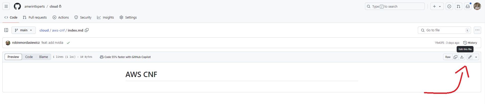
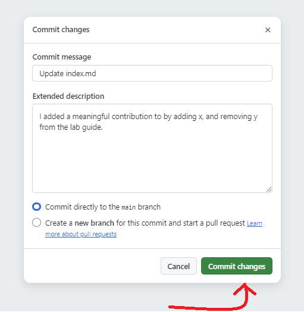
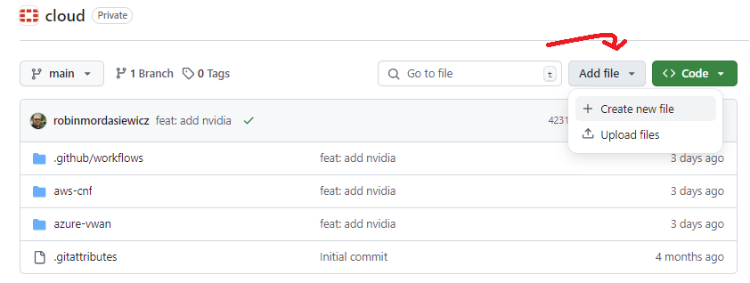
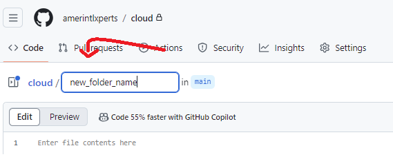
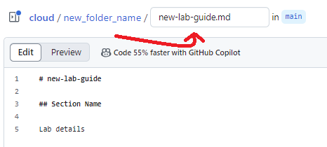

# FAQ

## Q1: How do I edit an existing markdown file?

1. Navigate to the file you want to edit in the GitHub repository.
2. Click the pencil icon (Edit this file) in the upper right corner of the file view.
    

3. Make your changes in the text editor & Click the "Commit changes" button in the top right hand corner of the page.
    

5. Add a brief description of your changes in the commit message field & Click "Commit changes" to save your edits.
    

## Q2: How do I add a new markdown file?

1. Navigate to the folder where you want to add the new file.
2. Click the "Add file" button, then select "Create new file".
    

   - (optional) If you need to add a new folder, simply type the new folder name, followed by "/" then your file name.
    

3. Name your file with a .md extension (e.g., new-lab-guide.md).
    

4. Add your content in markdown format & Click the "Commit changes" button in the top right hand corner of the page.
    

6. Add a brief description of your changes in the commit message field & Click "Commit changes" to save your edits.
    

## Q3: What are the basic markdown syntax elements I should know?

1. A Markdown Reference guide is located located within the References page. You can access it here:

[Markdown Reference Page](md-reference.md){ .md-button .md-button--primary }

## Q4: What are the basic MkDocs syntax elements I should know?

1. An MkDocs Reference guide is located located within the References page. You can access it here:

[MkDocs Reference Page](mkdocs/index.md){ .md-button .md-button--primary }
